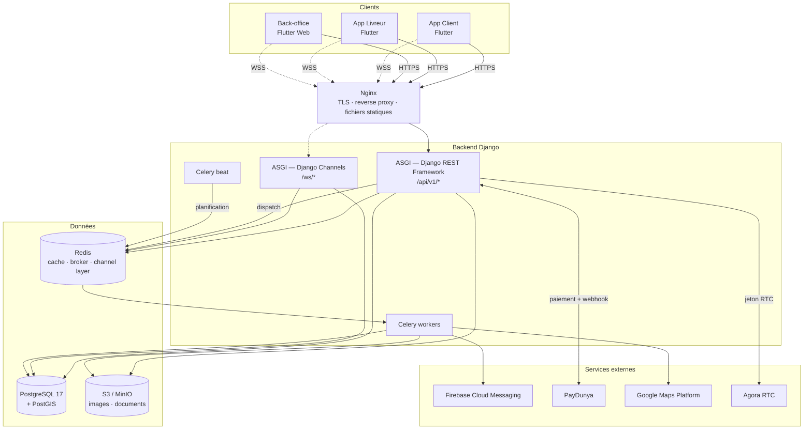
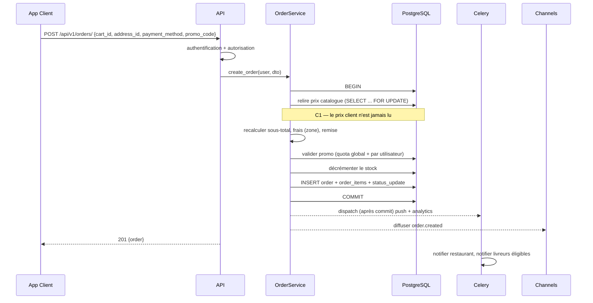
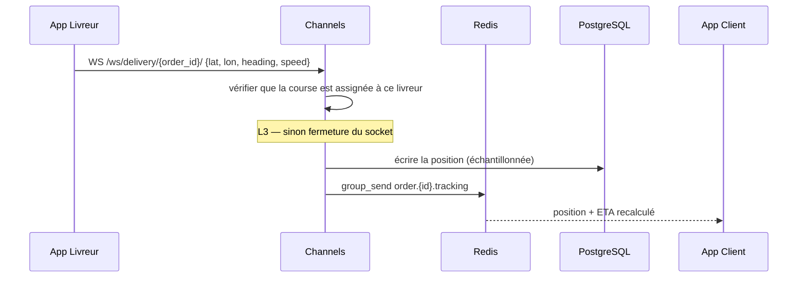
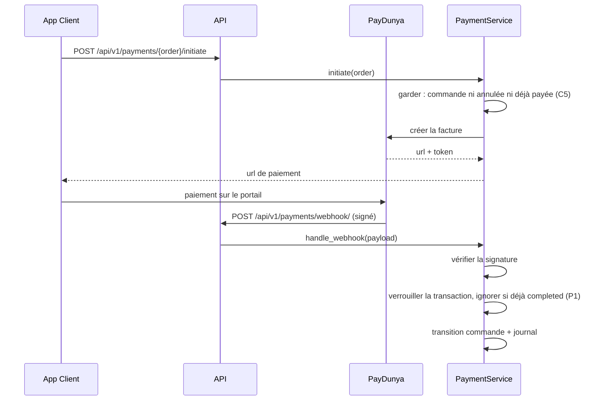
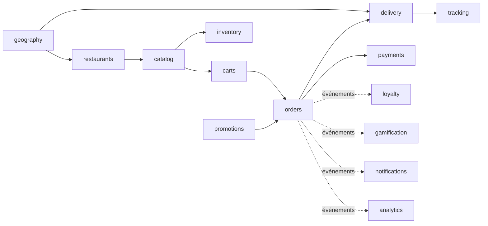

# Phase 2 — Architecture générale El Corazón v2

**Statut** : en vigueur · **Date** : 2026-07-25 · **Entrée** : [Phase 1](01-analyse-fonctionnelle.md)

---

## 1. Principe directeur

> **Le backend est la seule autorité métier. Flutter est un client, pas un participant.**

L'architecture précédente distribuait la logique entre trois apps Flutter attaquant directement la
base de données. Chaque règle métier existait donc en trois exemplaires — ou en zéro, ce qui a
produit les failles du §6 de la Phase 1. La v2 inverse ce rapport : **une règle, un endroit,
appliquée à chaque appel.**

Trois corollaires structurants :

1. **Aucun client n'a d'accès direct à la base.** Ni Flutter, ni le back-office. Tout passe par l'API.
2. **Le serveur ne fait jamais confiance à une valeur cliente** qu'il peut recalculer ou relire
   (prix, totaux, statuts de vérification, mentions « achat vérifié »).
3. **Les invariants critiques sont défendus par la base de données**, pas seulement par le code :
   contraintes `CHECK`, `UNIQUE`, clés étrangères, débits conditionnels atomiques. Le code applicatif
   est la première ligne, le schéma est la dernière.

---

## 2. Vue d'ensemble



### Pourquoi ASGI de bout en bout

Un seul processus type sert HTTP et WebSocket. Django 5+ gère les deux via ASGI ; scinder en deux
déploiements ajouterait de l'exploitation sans gain. La séparation reste possible plus tard
(routage Nginx par préfixe) sans toucher au code.

---

## 3. Responsabilités par composant

| Composant | Responsabilité | Ne fait **pas** |
|---|---|---|
| **Nginx** | Terminaison TLS, compression, fichiers statiques et médias, limitation de débit de premier niveau, montée en WebSocket | Aucune logique métier |
| **API (DRF)** | Authentification, autorisation, validation d'entrée, orchestration des services de domaine, sérialisation | Traitement long, appel réseau sortant bloquant |
| **Channels** | Diffusion d'événements aux abonnés, chat, réception des positions livreur | Écriture métier complexe — délègue aux services |
| **Celery worker** | Push FCM, e-mails, calcul d'itinéraires, agrégats analytics, génération de rapports | Rien de synchrone au parcours utilisateur |
| **Celery beat** | Expiration des points, renouvellement d'abonnements, purge des positions GPS, snapshots analytics | — |
| **PostgreSQL + PostGIS** | Vérité des données, invariants (contraintes), requêtes géospatiales | — |
| **Redis** | Cache applicatif, broker Celery, *channel layer*, compteurs de limitation de débit | Stockage durable — tout y est perdable |
| **S3 / MinIO** | Images produits, photos de profil, pièces d'identité livreurs, justificatifs | — |

**Règle d'or sur Redis** : aucune donnée dont la perte serait un incident métier. Un panier vit en
base, pas en cache.

---

## 4. Découpage en applications Django

Les 18 domaines de la Phase 1 deviennent 18 applications. Le chemin critique — validé avec toi —
est en **gras** : c'est ce qui est construit d'abord.

```
backend/
├── config/                    # settings (base/dev/prod/test), urls, asgi, celery
├── common/                    # socle transverse, sans dépendance aux apps
│   ├── models.py              #   UUIDModel, TimeStampedModel, SoftDeleteModel
│   ├── money.py               #   montants décimaux + devise
│   ├── state_machine.py       #   machine à états déclarative et testable
│   ├── permissions.py         #   permissions DRF réutilisables
│   ├── pagination.py          #   pagination standard
│   ├── exceptions.py          #   erreurs métier → réponses HTTP normalisées
│   └── geo.py                 #   helpers PostGIS (distance, proximité, couverture)
└── apps/
    ├── accounts/              # ★ identité, rôles, permissions, appareils, JWT
    ├── profiles/              # ★ adresses, préférences client
    ├── geography/             # ★ pays, villes, zones de livraison  (nouveau)
    ├── restaurants/           # ★ établissements, horaires, rattachement aux zones
    ├── catalog/               # ★ catégories, articles, personnalisation, avis
    ├── inventory/             #   stock matières et disponibilité article
    ├── carts/                 # ★ panier serveur
    ├── orders/                # ★ commandes, lignes, machine à états
    ├── payments/              # ★ transactions, PSP, paiement partagé, remboursements
    ├── delivery/              # ★ flotte, dossiers livreurs, affectation, courses
    ├── tracking/              # ★ positions, ETA, diffusion temps réel
    ├── promotions/            #   codes promo et conditions
    ├── loyalty/               #   points, récompenses, abonnements
    ├── gamification/          #   succès, défis, badges, séries
    ├── notifications/         # ★ notifications in-app, push, préférences
    ├── social/                #   groupes, publications, interactions
    ├── support/               #   tickets, réclamations, retours
    └── analytics/             #   événements, métriques, rapports
```

### Écarts assumés par rapport à la structure du brief

| Brief | Retenu | Raison |
|---|---|---|
| `users/` | `profiles/` | Django appelle déjà `User` le modèle d'authentification, porté par `accounts`. Deux apps nommées `accounts` et `users` produisent une ambiguïté permanente. `profiles` dit ce que l'app contient. |
| `catalog/` + `products/` | `catalog/` seul | Les deux désignent le même agrégat : une catégorie sans ses articles n'a pas d'existence métier. Deux apps imposeraient une dépendance circulaire ou une frontière artificielle. |
| — | `geography/` **ajouté** | Le multi-pays exigé n'a aucun support dans l'existant. Pays → ville → zone est le socle dont dépendent `restaurants`, `delivery` et le barème de frais. Sans cette app, le multi-pays reste déclaratif. |
| — | `carts/` **ajouté** | Le panier a son propre cycle de vie (persistance, expiration, fusion invité→client, revalidation des prix). L'héberger dans `orders` mélangerait un état éphémère et un état comptable. |
| — | `gamification/`, `social/` **ajoutés** | Présents dans le produit (§4 Phase 1), absents de la liste du brief. Séparés de `loyalty` : les points ont une valeur monétaire et un journal auditable, les badges non. |

---

## 5. Couches internes

```
HTTP ─→ URL ─→ ViewSet ─→ Serializer (validation d'entrée)
                  │
                  ├─→ Permission (autorisation)
                  │
                  └─→ Service de domaine ─→ Repository ─→ ORM ─→ PostgreSQL
                            │
                            └─→ Événement de domaine ─→ Celery / Channels
```

| Couche | Contient | Ne contient pas |
|---|---|---|
| **ViewSet** | Routage, codes HTTP, pagination | Toute règle métier |
| **Serializer** | Validation de forme, sérialisation de sortie | Décisions métier, accès base |
| **Permission** | « Qui a le droit » | « Est-ce possible » (c'est le service) |
| **Service** | Règles métier, transactions, orchestration, émission d'événements | HTTP, `request`, sérialisation |
| **Repository** | Requêtes complexes et réutilisées, chargements optimisés | Règles métier |

### Où l'on n'applique **pas** ces couches

L'implémentation précédente a produit 40 classes de validation et 6 politiques d'autorisation, dont
une partie ne servait qu'à traverser des CRUD triviaux. Leçon retenue et érigée en règle :

> **Un service n'existe que s'il porte une décision métier ou une transaction.**
> **Un repository n'existe que si une requête est complexe ou réutilisée.**

Un CRUD administrateur sur les catégories de menu va du ViewSet à l'ORM sans intermédiaire. Ajouter
un service qui appelle `.save()` n'est pas de l'architecture propre, c'est du coût de maintenance
déguisé en rigueur. La complexité se justifie au cas par cas, jamais par symétrie.

**Portent un service** (décision ou transaction réelle) : commandes, paiements, livraison, panier,
fidélité, promotions.
**N'en portent pas** : CRUD catalogue, CRUD géographie, CRUD adresses, lecture de notifications.

---

## 6. Flux de données critiques

### 6.1 Passage de commande



Le `dispatch` après commit — et non pendant — évite de notifier une commande qui n'existera pas si
la transaction échoue.

### 6.2 Suivi de livraison temps réel



L'écriture en base est **échantillonnée** (une position sur N, ou au franchissement d'un seuil de
distance) : à 10 s par livreur et 200 livreurs actifs, l'écriture systématique produirait 1,7 M de
lignes par jour pour une valeur analytique faible. La diffusion, elle, est intégrale.

### 6.3 Encaissement Mobile Money



Le webhook est **la seule source de vérité** de l'encaissement. Le retour du client sur l'app n'est
qu'un indice d'interface : il ne déclenche aucune écriture d'état de paiement.

---

## 7. Communication entre applications

Les apps Django ne s'appellent pas librement entre elles — ce serait reconstituer un monolithe
enchevêtré sous une arborescence propre. Deux mécanismes seulement :

1. **Appel direct de service**, autorisé uniquement selon un graphe de dépendances **acyclique**.
   `orders` peut appeler `catalog` et `promotions` ; `catalog` n'appelle jamais `orders`.
2. **Événements de domaine** pour tout le reste. `orders` émet `OrderDelivered` ; `loyalty`,
   `gamification`, `analytics` et `notifications` y réagissent sans que `orders` les connaisse.



C'est ce graphe qui rend une extraction future en service autonome possible : `tracking` et
`analytics` sont déjà des feuilles.

---

## 8. Sécurité

| Niveau | Mesure |
|---|---|
| Transport | TLS obligatoire, HSTS, WebSocket sur WSS uniquement |
| Authentification | JWT courte durée + *refresh* rotatif avec liste de révocation (ADR-004) |
| Force brute | Limitation par IP **et** par identifiant sur `/auth/*` (T1) |
| Autorisation | Refus par défaut ; permission explicite par point d'entrée (T3) |
| Entrées | Validation par sérialiseur, jamais `**request.data` |
| Concurrence | `SELECT FOR UPDATE` ou débit conditionnel atomique sur tout décrément de solde ou de stock (F1, L2) |
| Webhooks | Signature vérifiée, traitement idempotent, limitation de débit dédiée (P1) |
| Fichiers | URL signées à durée limitée ; les pièces d'identité livreurs ne sont jamais publiques |
| Secrets | Variables d'environnement, jamais en dépôt ; `.env.example` documenté sans valeur réelle |
| RGPD | Effacement en cascade, journal d'accès aux données sensibles, minimisation des positions GPS |

---

## 9. Modèle de déploiement

### Développement (`docker compose up`)

| Service | Image | Port |
|---|---|---|
| `db` | `postgis/postgis:17-3.5` | 5432 |
| `redis` | `redis:7-alpine` | 6379 |
| `api` | build local, `runserver` ASGI + rechargement | 8000 |
| `worker` | build local, `celery worker` | — |
| `beat` | build local, `celery beat` | — |
| `minio` | `minio/minio` | 9000 / 9001 |
| `nginx` | `nginx:alpine` | 80 |

> **Note d'exécution** : Docker Desktop et Compose sont installés sur le poste depuis le
> 25/07/2026 ; PostGIS et Redis tournent en conteneur. La suite de tests s'exécute **dans l'image**
> (`docker compose run --rm api pytest`), parce que GeoDjango dépend de GDAL et GEOS, qui sont des
> bibliothèques système et non des paquets Python. Il n'existe pas de repli SQLite : le schéma
> emploie `ArrayField`, `geography` et des index GiST qu'un autre moteur ne porterait pas.

### Production

Kubernetes, avec trois déploiements distincts issus de la **même image** : `api` (ASGI, HPA sur la
latence), `worker` (HPA sur la profondeur de file), `beat` (réplique unique). PostgreSQL et Redis
sont des services managés. Les migrations tournent en `initContainer`.

---

## 10. Registre des décisions

| ADR | Décision |
|---|---|
| [001](adr/001-socle-technique.md) | Django 5.2 LTS + DRF + Channels |
| [002](adr/002-decoupage-en-apps.md) | Découpage par domaine métier, dépendances acycliques |
| [003](adr/003-couches-et-proportionnalite.md) | Services et repositories **proportionnés**, pas systématiques |
| [004](adr/004-authentification-jwt.md) | JWT avec refresh rotatif et révocation |
| [005](adr/005-modele-d-autorisation.md) | Rôle unique + permissions granulaires unifiés |
| [006](adr/006-multi-tenant-geographique.md) | Hiérarchie pays → ville → zone → restaurant |
| [007](adr/007-identifiants-et-montants.md) | UUIDv7 et montants décimaux multi-devises |
| [008](adr/008-temps-reel-channels-vs-push.md) | Channels pour le flux, FCM pour le hors-application |
| [009](adr/009-contrat-d-api.md) | Rupture assumée avec les clients Dart actuels |
| [010](adr/010-machines-a-etats.md) | Transitions déclaratives, monotones, testables |

---

## 11. Ce qui entre en Phase 3

Le modèle de données : hiérarchie géographique, agrégat restaurant, catalogue rattaché, machine à
états matérialisée en contraintes, journal de fidélité, et index géospatiaux.
