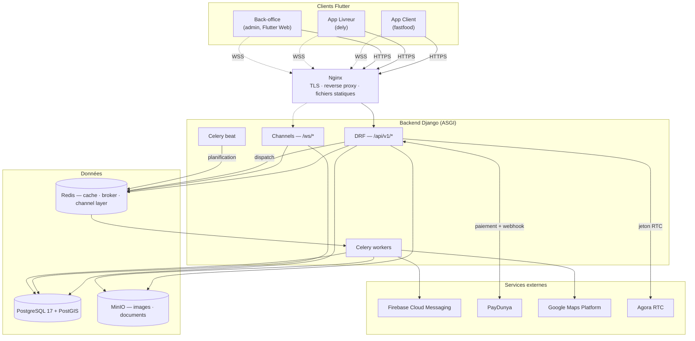
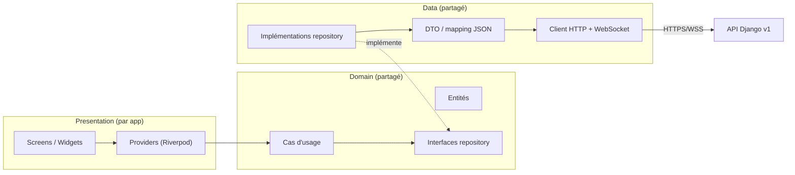

# Phase 6 — Migration Flutter vers l'architecture Django v2

**Statut** : en cours (`fastfood` migré sauf social/commande groupée — **backend désormais complet des deux côtés**, reste la réécriture Flutter ; `dely` migré ; `admin` : rien) · **Date** : 2026-07-30 · **Entrée** : [02 — Architecture générale](02-architecture-generale.md), [ADR-009](adr/009-contrat-d-api.md)

---

## 1. Contexte et décision

Le backend (`backend/`) porte aujourd'hui l'intégralité du chemin critique et des domaines
secondaires (18 apps, chemin critique + fidélité, gamification, social, support, analytics,
abonnements — voir [README](README.md#avancement)). **Il ne reste que la Phase 6.** Les trois
applications Flutter (`El Corazon fastfood`, `El corazon dely`, `El Corazon admin`) n'ont en
revanche subi aucune migration : elles lisent et écrivent encore directement dans Supabase
(Auth, Postgres, Realtime, Storage), plus un canal Socket.IO résiduel côté `fastfood`.

**Décision actée pour cette phase : rupture nette, pas de coexistence.** ADR-009 envisageait une
bascule domaine par domaine avec les apps continuant d'attaquer Supabase pour les domaines non
encore migrés le temps de la transition. Ce n'est plus la voie retenue : **Supabase n'est plus
utilisé du tout** dès que ce plan est engagé. Chaque domaine migré au fil de ce plan supprime son
code Supabase correspondant au lieu de le laisser vivre à côté ; il n'y a pas de double lecture
transitoire ni de synchronisation entre les deux backends.

Conséquence directe : aucune migration de données de production Supabase n'est nécessaire (pas
d'utilisateurs réels à reprendre) — c'est un démarrage à froid sur le backend Django.

---

## 2. Plan architectural cible

### 2.1 Vue d'ensemble

Principe directeur inchangé (ADR déjà actés) : **le backend est la seule autorité métier, Flutter
est un client.** Aucune app Flutter n'a d'accès direct à une base de données après cette phase —
ni Postgres (Supabase), ni règle métier dupliquée côté client.

### 2.2 Couches côté client — Clean Architecture

Chaque app adopte la même stratification, alimentée par un module Dart partagé (§3.1) :

- **Presentation** reste propre à chaque app (écrans très différents entre client, livreur,
  back-office) — c'est la seule couche non partagée.
- **Domain** et **data** sont partagés au maximum : c'est la réponse structurelle à la duplication
  déjà identifiée (~130 fichiers de services entre les 3 apps, dont une trentaine de quasi-doublons
  — Phase 1 §7).

### 2.3 Contrat d'API à respecter côté client (ADR-009)

La couche `data` du module partagé doit implémenter, dès le départ, les règles du contrat propre —
c'est justement l'occasion actée par ADR-009 de lever les trois travers de l'ancien client Dart :

| Règle | Détail |
|---|---|
| Versionnement | `/api/v1/...`, jamais d'URL non versionnée |
| Liste paginée | `{count, next, previous, results}` — plus de lecture à la racine (`current_page`/`last_page`) |
| Erreurs | `application/problem+json` (RFC 9457) ; le client teste `code`, jamais `detail` (traduisible, changeant) |
| Dates | ISO 8601 UTC, garanties non nulles quand déclarées ainsi dans le schéma OpenAPI — plus de `DateTime.parse` sans garde |
| Montants | objet `{"amount": "...", "currency": "XOF"}`, jamais un float |
| Idempotence | en-tête `Idempotency-Key` obligatoire à générer côté client sur la création de commande et l'initiation de paiement |
| Documentation | schéma OpenAPI généré (`drf-spectacular`), servi sur `/api/v1/schema/` et publié comme artefact CI (`contrat`) — s'en servir comme source de vérité pour les DTO, éventuellement génération de code |

---

## 3. Ce qu'il faut faire

### 3.0 Prérequis backend (avant d'ouvrir le chantier Flutter)

- [x] **Chat WebSocket + tableau de bord restaurant construits** (2026-07-27) : `ws/orders/<id>/chat/`
      (`OrderChatConsumer`, relais non persisté client ↔ livreur) et
      `ws/restaurants/<id>/dashboard/` (`RestaurantDashboardConsumer`, lecture seule, diffusé par
      `OrderService.transition_to` en plus du suivi client). Testés (autorisation à la connexion,
      relais, non-fuite entre établissements) ; suite complète (875 tests), ruff et mypy verts.
- [ ] **Valider FCM en conditions réelles** : `apps/notifications/fcm.py` n'a jamais été exercé
      contre un vrai projet Firebase. La commande `python manage.py send_test_push <jeton>`
      (ajoutée le 2026-07-27, `apps/notifications/management/commands/send_test_push.py`) passe
      par le `PUSH_BACKEND` configuré — il ne reste plus qu'à fournir un projet Firebase, des
      credentials de service (`FCM_CREDENTIALS_PATH`, `FCM_PROJECT_ID`) et un jeton d'appareil de
      test pour exécuter la validation réelle.
- [x] **MinIO validé en conditions réelles** (2026-07-27) : `default_storage.save()` contre une
      instance MinIO locale réelle (`docker compose up -d minio`, bucket `elcorazon` créé), lecture
      via l'URL signée générée par `default_storage.url()` (200, contenu identique), accès direct
      sans signature refusé (403 — confirme que le stockage n'est pas public par défaut,
      `AWS_QUERYSTRING_AUTH=True`), suppression confirmée. Le connecteur S3/MinIO fonctionne tel que
      configuré.
- [x] **CI GitHub confirmée verte** (2026-07-27) : le run déclenché par le remote configuré la
      veille avait en réalité échoué (`makemigrations --check` — Meta.ordering ajouté sur
      `Achievement`/`Badge` sans migration générée) ; migration `0002_alter_achievement_options_
      alter_badge_options` ajoutée, run suivant `success` (`.github/workflows/backend-ci.yml`).

### 3.1 Fondations Flutter partagées

- [x] **Package `packages/elcorazon_core/` créé** (2026-07-27), dépendance locale
      (`path: ../packages/elcorazon_core`) — borné à ce que l'authentification exige, pas plus :
  - `network/api_client.dart` — `Dio`, intercepteur JWT, **rafraîchissement single-flight** sur 401
    (un verrou partagé — `Future<String>? _refreshInFlight` — garantit qu'un seul appel à
    `/auth/token/refresh/` part même si plusieurs requêtes échouent en même temps ; le refresh token
    est à usage unique côté serveur, rotation + liste noire), mapping `problem+json` → `ApiException`
    typée par `code`.
  - `auth/token_storage.dart` — adapté de `El Corazon fastfood/lib/services/secure_token_storage_service.dart`
    (construit mais jamais branché côté Supabase — récupéré plutôt que réécrit).
  - `auth/auth_repository.dart` — register/login/refresh/logout/me/changePassword/registerDevice.
  - `auth/session.dart` — `sessionProvider` (Riverpod `AsyncNotifier<User?>`), porte la garde de rôle
    par type de compte (`allowedUserType`, vérifiée après `login()` **et** `restoreSession()`).
  - `models/user.dart` — classe à la main (pas de freezed/json_serializable : aucun des deux n'est
    utilisé ailleurs dans les 3 apps malgré leur présence en dépendance).
  - **Étendu domaine par domaine depuis** (2026-07-28/29), un module par domaine migré :
    `catalog/` (dont `review.dart` — les avis vivent sous `/catalog/reviews/`), `geography/`,
    `cart/`, `orders/`, `payments/`, `profile/`, `loyalty/`, `gamification/`, `social/`,
    `support/`, `notifications/`, `realtime/` (client WebSocket générique avec reconnexion,
    utilisé par le suivi de commande), `delivery/` (affectations, dossier livreur, et
    `assignment_offer.dart` — la charge utile de `delivery.offered`) et `tracking/` (relevés de
    position).
  - **Pas encore construit** : aide upload/lecture signée MinIO (§3.4).
  - Testé (87 tests, `flutter test` + `flutter analyze` verts) : parsing du contrat de chaque
    domaine, `TokenStorage`, et surtout la concurrence de rafraîchissement (`ApiClient —
    rafraîchissement sur 401`, simulée par un faux serveur puisqu'un vrai test de course en
    conditions réelles n'est pas fiable). Les tests de repository vérifient autant ce que le client
    **n'envoie pas** (`is_public`, `is_verified_purchase`, compteurs, identifiants d'utilisateur)
    que ce qu'il lit — c'est là que se joue le respect de C1/S1.
- [ ] Chaque app ne garde en propre que sa couche `presentation/` et les repositories spécifiques
      à ses écrans (ex. gestion de flotte côté `admin`, navigation GPS côté `dely`).

### 3.2 Authentification (fondation commune, transverse aux 3 apps)

- [x] **`dely` branché sur Django** (2026-07-27), **`fastfood` branché sur Django** (2026-07-28) —
      voir §3.3. `admin` suit le même patron, pas encore fait.
- [x] Décision prise en session : **Riverpod introduit, mais seulement pour la couche auth/session**
      — le reste de l'état de chaque app (panier, catalogue, tracking...) reste sur
      Provider/ChangeNotifier jusqu'à ce que son propre domaine soit migré. Les deux cohabitent via
      `UncontrolledProviderScope` (un `ProviderContainer` créé une fois dans `main()`) plutôt qu'une
      réécriture complète de la gestion d'état — voir `El corazon dely/lib/main.dart` et
      `AppService._onSessionChanged` (le pont qui recopie `sessionProvider` dans `_currentUser`).
- [x] Migrer la gestion de session (accès + refresh rotatif, révocation) — fait pour `dely`.
- [ ] Aligner le modèle de rôles/permissions client sur ADR-005 (le back-office n'est plus la
      barrière d'autorisation, seulement un confort d'affichage — le serveur refuse de toute façon).
- [x] **Écart de périmètre découvert en construisant `dely`, désormais comblé** : le backend n'avait
      aucun endpoint pour créer un compte livreur (`/auth/register/` ne crée que des `customer` ;
      `apps/delivery` n'exposait les profils livreurs qu'en lecture). Tranché en session le
      2026-07-29 : **provisioning par le personnel**, pas de self-service. Un livreur ne s'inscrit
      pas, parce que son dossier le rattache à un établissement et que personne ne s'attribue un
      rattachement à soi-même. D'où `POST /api/v1/delivery/couriers/`, sous la permission
      `couriers.write` (distincte de `couriers.read` : lire la flotte ne donne pas le droit
      d'embaucher) et sous `assert_in_scope` — on n'embauche pas pour un établissement hors
      périmètre. Le compte naît `courier` + dossier `pending` : embaucher ne vaut pas valider, aucune
      pièce n'ayant encore été lue. `registerDriver*` peut donc quitter `dely` et son code Supabase
      être retiré (l'accès avait déjà disparu de l'écran de connexion).

### 3.3 Migration domaine par domaine

Ordre retenu par app, du risque le plus faible (lecture seule) au plus élevé (argent, temps réel) :

**`fastfood` (client)**
1. [x] Auth — connexion, inscription, déconnexion, restauration de session, garde de rôle
   `customer` (2026-07-28). Contrairement à `dely`, l'inscription **est** migrée : le backend crée
   toujours un `customer` par conception, ce qui correspond exactement à cette app. OTP
   téléphone, Google OAuth et « mot de passe oublié » retirés de l'écran de connexion (aucun des
   trois n'a d'équivalent côté Django — décision prise en session : email + mot de passe
   seulement pour l'instant). Même prudence que `dely` : seuls `login`/`register`/`logout`/
   `_loadUserSession` touchés dans `AppService`, `DatabaseService` intact. Deux fichiers dès lors
   totalement morts supprimés (`secure_token_storage_service.dart`,
   `README_SECURE_TOKEN_STORAGE.md` — construits pour Supabase, jamais branchés, remplacés par le
   `TokenStorage` du package partagé qui en reprenait déjà la base) ; `otp_verification_screen.dart`
   et la route associée laissés en place mais inatteignables, comme le fait `dely` pour son écran
   d'inscription.
2. [x] Géographie / restaurants / catalogue (2026-07-28) — `DjangoMenuRepository` implémente
   l'interface `MenuRepository` existante et traduit vers les modèles locaux, si bien que les
   écrans n'ont pas bougé ; `supabase_menu_repository.dart` supprimé. Pas de WebSocket catalogue
   prévu : `watchMenuItems` garde le polling 30 s de l'implémentation précédente.
3. [x] Panier serveur (`carts`, 2026-07-28) — `CartService` synchronise contre `/carts/`.
4. [x] Commandes (`orders`, 2026-07-28) — `DjangoOrderRepository.createFromServerCart()` crée la
   commande **depuis le panier serveur**, avec `Idempotency-Key` généré par le client ; les deux
   méthodes de l'interface locale qui n'ont pas d'équivalent au contrat (`createOrder` depuis un
   `Order` construit côté client, `updateOrderStatus` réservé au personnel) ne sont implémentées
   que pour satisfaire l'interface. `supabase_order_repository.dart` supprimé. Le code promo est
   transmis à la création et validé par le serveur ; en revanche `PromoCodeService` reste un
   catalogue en stockage local (voir l'écart plus bas).
5. [x] Paiements (`payments`, 2026-07-28) — `eccore.PaymentRepository` et `CheckoutInstruction`
   dans `payment_screen.dart` ; plus de paiement simulé côté client.
6. [x] Suivi temps réel (2026-07-28) — `eccore.RealtimeChannel` (reconnexion avec repli
   exponentiel, une fermeture 4403 ne retente pas) sur `ws/orders/<id>/tracking/`, consommé par
   `RealtimeTrackingService`.
7. [x] Fidélité et gamification (2026-07-28), **support et avis produits (2026-07-29)** :
   - `loyalty` — solde, catalogue de récompenses et journal viennent du serveur ; un point ne
     s'obtient qu'à la livraison, jamais par un calcul client.
   - `gamification` — badges Django (`isUnlocked`/`unlockedAt` servis, plus recalculés) ; les
     achievements et défis restent simulés côté client, faute d'écran qui les affiche.
   - `support` — tickets, fil de messages, réclamations et retours sur `/support/*`.
     `support_screen.dart` chargeait sa liste… jamais : l'appel manquait, la liste était donc
     vide en permanence quel que soit le backend ; corrigé au passage. Catégories alignées sur
     `TicketCategory` (« Général » n'existe pas côté serveur, remplacé par « Autre »).
   - **avis produits** — `/catalog/reviews/`. Trois choses que le client faisait disparaissent :
     calculer la moyenne des notes (elle vit sur l'article), deviner l'achat vérifié (le serveur
     le décide, S1), et transformer un second avis en modification (`upsert` → le serveur refuse,
     un avis par article et par personne, S5).
   - **social — pas migré**, voir l'écart de périmètre plus bas.
8. [x] Notifications (2026-07-29) — deux moitiés :
   - **historique** migré sur `/notifications/` (liste paginée, `unread-count` en route dédiée,
     marquage lu unitaire et global). L'écriture depuis le client disparaît entièrement : plus de
     `saveNotification` ni de famille `sendWelcomeNotification`/`sendPromotionNotification`, et
     plus de suppression (le contrat ne l'expose pas — le serveur décide seul de la durée de vie
     d'une notification). Les entrées correspondantes de l'écran ont été retirées.
   - **push FCM construit** : `firebase_core`/`firebase_messaging` ajoutés, permission, jeton
     d'appareil enregistré auprès de `/auth/devices/` après connexion et retiré **avant** la
     déconnexion (l'endpoint exige la session qu'on ferme), ré-enregistrement sur rotation du
     jeton (`onTokenRefresh` — sans quoi l'appareil cesse de recevoir en silence), affichage au
     premier plan et handler d'arrière-plan. ⚠️ `lib/firebase_options.dart` ne contient que des
     **valeurs de remplissage** : aucun projet Firebase n'existe encore (§3.0). L'initialisation
     est donc non bloquante — l'app démarre sans push plutôt que de refuser de se lancer. Même
     état que `dely`. La configuration Android/iOS (`google-services.json`, plugin Gradle,
     `GoogleService-Info.plist`) reste à faire en même temps que le vrai projet.

✅ **Commande groupée — l'écart est comblé côté backend** (2026-07-30). L'alternative posée le
2026-07-29 (« construire ou retirer ») est tranchée : construite, dans une app dédiée
`apps/groupcarts`. Ce qui existe désormais :

- `GroupCart` / `GroupCartMember` / `GroupCartLine` — un panier partagé par établissement, ouvert par
  un **hôte**, rejoint par **code d'invitation** à six caractères (alphabet sans `O`/`0` ni `I`/`1`,
  parce qu'un code se lit à voix haute), avec **échéance obligatoire** (2 h par défaut, `GROUP_CART_*`
  en réglage). Trois principes, chacun réponse à un défaut de l'existant Supabase :
  **(1)** le panier n'est **pas** une commande — aucune `Order` n'existe avant confirmation, là où
  `group_order_screen.dart` écrivait dans `orders`/`order_items` dès l'ouverture ;
  **(2)** une ligne **appartient à celui qui l'a déposée** — `member` est la clé du droit d'écriture,
  pas une donnée d'affichage, alors que l'abonnement Realtime donnait à tous l'écriture sur les mêmes
  lignes ; **(3)** aucun montant n'est stocké (C1).
- `POST /api/v1/group-carts/` (ouvrir) · `join/` (par code) · `{id}/lines/` (déposer, modifier,
  retirer) · `{id}/lock/` (clore les ajouts) · `{id}/confirm/` (→ **une** commande) · `{id}/cancel/`.
  L'appartenance est un **filtre** et non une permission : le panier d'un groupe étranger est
  introuvable, pas interdit — un 403 confirmerait son existence.
- `ws/group-carts/{id}/` — synchronisation temps réel, autorisée **avant** l'acceptation du socket sur
  l'appartenance réelle (ADR-008). Lecture seule : les contributions passent par HTTP, qui valide
  l'article, ses options et l'échéance. C'est le point exact où l'ancienne version ne validait rien.
- La confirmation emprunte `OrderService.create_from_selection`, extrait de `create_from_cart` pour
  l'occasion : même relecture des prix, même décompte de stock sous verrou, même barème de zone, même
  évaluation du code promo. De même, la valorisation passe par `price_selection`, désormais partagée
  avec le panier personnel via le protocole `PriceableLine`. **Aucun second chemin de calcul** — c'est
  ainsi que les frais de livraison de l'implémentation précédente avaient fini par être calculés deux
  fois différemment.
- Pas d'en-tête d'idempotence sur `confirm/`, contrairement à `POST /orders/`, et ce n'est pas un
  oubli : le panier **est** la clé. Un second appel trouve un statut `confirmed` et la machine à états
  refuse la transition ; deux appels simultanés sont sérialisés par `select_for_update`.
- Tâche `expire_group_carts` toutes les 5 min. L'échéance est déjà opposée à chaque ajout, donc rien
  d'incorrect ne passe entre deux tours ; la tâche sert à *dire* au groupe que c'est terminé.
- 54 tests (`tests/groupcarts/`) : API, machine à états exhaustive, WebSocket.

**Reste côté Flutter** : réécrire `group_order_screen.dart` (2867 lignes) et la partie « commandes de
groupe » de `SocialService` contre ces endpoints, puis retirer le code Supabase correspondant.

- **Groupes sociaux et publications** — le repository partagé existe et est testé
  (`elcorazon_core/social/`), mais le seul écran qui consomme les groupes est celui de la commande
  groupée : le branchement suit sa réécriture.

⚠️ **Écarts de périmètre restants côté `fastfood`** (aucun endpoint Django équivalent) :
- **Notation du livreur** (`DriverRatingService`) — `rating_average`/`rating_count` sont en lecture
  seule sur le profil livreur, rien ne permet de déposer une note. Reste sur Supabase.
- **« Avis utile »** — `helpful_count` est servi mais aucun endpoint ne l'incrémente ; le bouton et
  le tri correspondants ont été retirés.
- **Photos d'avis** — absentes du contrat, retirées de l'affichage.
- **Codes promo** — la validation à la création de commande est bien serveur ; en revanche
  `PromoCodeService` reste un catalogue en stockage local, sans équivalent lu depuis
  `/promotions/`. `promo_code_service_supabase.dart` (aucun appelant) a été supprimé.

**`dely` (livreur)**
1. [x] Auth — connexion, déconnexion, restauration de session, garde de rôle `courier` (2026-07-27).
   Inscription **non migrée** (voir l'écart de périmètre en 3.2) ; `loginDriver`/`logout`/
   `initialize()` seuls touchés dans `AppService` — `DatabaseService` n'a volontairement pas été
   modifié (les appels Supabase pour les domaines pas encore migrés, ex. `updateUserOnlineStatus`,
   restent inertes pour un compte Django tant que le domaine livraison n'a pas son tour, plutôt que
   de risquer une régression en touchant un fichier de 1000+ lignes hors du périmètre auth).
   `AppService.login()` (chemin Supabase) a depuis été supprimé (2026-07-29) : il n'avait plus
   aucun appelant et ouvrait le suivi temps réel sur une identité inconnue du backend.
2. [x] Affectation et gestion des courses (`delivery`, 2026-07-29) — `DjangoDeliveryRepository`
   assemble une `Course` (l'affectation Django + la commande qu'elle porte, traduite vers le
   modèle local) : les écrans continuent de raisonner en commandes alors que **toutes les actions
   s'adressent à la course**. Deux choses que faisait l'app Supabase disparaissent, et ce sont
   les deux qui comptent :
   - **le vivier de commandes à se partager n'existe pas**. Le personnel propose une course à un
     livreur nommé (`AssignmentService.offer`) ; « disponible » veut désormais dire « proposée à
     moi ». L'acceptation est exclusive côté serveur (L2), rien n'est donc affiché comme acquis
     avant la réponse ;
   - **le client n'écrit jamais le statut de la commande**. Il fait avancer la course, la commande
     suit par projection serveur (`ORDER_STATUS_PROJECTION`) — c'est une projection écrite à la
     main côté client qui avait produit C4. Les boutons affichés viennent d'`allowedTransitions`,
     la machine à états n'est pas rejouée. L'éligibilité se lit sur le dossier
     (`canAcceptOrders`, L1), elle ne se recompose pas depuis « en ligne ».
3. [x] Émission de position (2026-07-29) — **par HTTP (`/tracking/assignments/{id}/pings/`), pas
   par le WebSocket** : `ws/couriers/me/` (`CourierFeedConsumer`) est une file de propositions en
   **lecture seule**, rien n'y remonte. Ce point du plan était donc faux, et c'est le contrat qui
   tranche : la file sert à recevoir des courses, les relevés partent en HTTP. Un relevé perdu
   n'est pas relancé (c'est le suivant qui compte) ; la cadence est de 10 s, celle qu'attend
   `TrackingPingThrottle`, le serveur écartant lui-même tout relevé à moins de
   `TRACKING_MIN_WRITE_METERS` du précédent (202, qui n'est pas un échec).
   Deux corrections de fond au passage :
   - **l'émission suivait un écran**, `real_time_tracking_screen.dart` : fermer la carte
     suffisait à disparaître du suivi. Elle vit désormais le temps de la session, portée par
     `AppService` — la boucle GPS de `RealtimeTrackingService` n'émettait quant à elle
     strictement rien (un `debugPrint`, jamais d'appel réseau) ;
   - **la file des courses n'était pas consommée du tout** : un livreur ne découvrait une course
     qu'au rechargement suivant, alors que c'est le seul flux où rater un message a un coût
     métier direct (ADR-008). `ws/couriers/me/` est branché, et une proposition déclenche le
     rechargement de la liste — le message alerte, l'API fait autorité.
   `supabase_realtime_service.dart` (façade Supabase Realtime, seul appelant de ce service) est
   supprimé ; `RealtimeTrackingService` ne transporte plus que du Django.
4. [x] Jeton FCM enregistré via `AuthRepository.registerDevice()` après connexion (2026-07-27) —
   best-effort, ne bloque pas la connexion en cas d'échec.
5. [x] Clés Supabase codées en dur retirées de `api_config.dart` (2026-07-27) — la clé Google Maps,
   elle, reste (toujours utilisée par 3 services non liés à Supabase).

**`admin` (back-office)**
1. Auth + permissions (fait en 3.2, ADR-005) — **pas encore fait**, patron identique à `dely`
   (`allowedUserType = UserType.staff`).
   ⚠️ Ne pas couper l'accès à `Supabase.instance.client.auth.admin.createUser(...)`
   (`admin_auth_service.dart:508`, provisioning de comptes tiers) même une fois le login de l'admin
   migré — aucun endpoint Django équivalent n'existe.
2. Gestion établissements / catalogue / personnel (`restaurants`, `catalog`, `accounts` scoping)
3. Supervision commandes / livraison (lecture des mêmes endpoints que `fastfood`/`dely`, vues
   agrégées)
4. Analytics / rapports (`analytics`)
5. Notifications push (absentes aujourd'hui — à construire)

Pour chaque domaine : (a) consulter le schéma OpenAPI du domaine, (b) écrire le repository Dart
contre ce contrat, (c) remplacer l'appel Supabase existant dans les providers/services, (d)
supprimer le code Supabase mort immédiatement (pas de code mort transitoire — cf. §1), (e) valider
le parcours manuellement.

### 3.4 Flux externes à rattacher

- [ ] **Agora** : la signalisation d'appel (qui appelle qui) migre de Supabase Realtime vers un
      canal Django (WebSocket ou endpoint dédié) ; le flux média reste Agora RTC en pair-à-pair,
      seul le jeton est délivré par l'API (`API -->|jeton RTC| RTC` dans le schéma §2.1).
- [ ] **Stockage** : toutes les images produits, avatars et documents livreurs passent par les URL
      signées MinIO servies par le backend.

### 3.5 Nettoyage Supabase

- [ ] Retirer `supabase_flutter`, `lib/supabase/`, toute clé/URL Supabase des 3 `pubspec.yaml` et
      fichiers `.env`. ⚠️ Toujours bloqué côté `fastfood`, mais **plus pour la même raison** : le
      backend de la commande groupée existe (§3.3), il reste à réécrire `group_order_screen.dart`
      contre lui. Et par `DatabaseService`, volontairement intact tant que des domaines non migrés
      s'appuient dessus.
- [x] Code Supabase devenu mort supprimé au fil des tranches : `supabase_menu_repository.dart`,
      `supabase_order_repository.dart`, `secure_token_storage_service.dart`,
      `social_features_service.dart` (672 lignes, aucun appelant),
      `promo_code_service_supabase.dart` (aucun appelant) et, côté `dely`,
      `supabase_realtime_service.dart` avec `AppService.login()`.
- [ ] Retirer le canal Socket.IO résiduel dans `fastfood` (`socket_service.dart` et usages),
      remplacé par le WebSocket Django.
- [ ] Mettre à jour `CAHIER_DES_CHARGES.md` et `ETAT_FONCTIONNALITES.md` (actuellement rédigés pour
      l'architecture Supabase) : soit les archiver comme référence historique — à l'image du
      backend Laravel, consultable dans l'historique git jusqu'au commit `56e0bec` — soit les
      réécrire pour décrire la v2.

### 3.6 Infrastructure de déploiement réelle

- [ ] Provisionner l'environnement cible (Kubernetes selon `02-architecture-generale.md §9`, ou une
      étape intermédiaire sur le `docker-compose.yml` existant) avec les secrets réels (Firebase,
      PayDunya production, Google Maps, Agora).
- [ ] Domaine + TLS via Nginx ; le job CI `image` construit déjà l'image — il manque la publication
      vers un registre et le déploiement effectif.

### 3.7 Validation de bout en bout et bascule finale

- [ ] Parcours complet **client** : inscription → catalogue → panier → commande → paiement → suivi
      temps réel → notation.
- [ ] Parcours complet **livreur** : réception de course → navigation → livraison → notifications.
- [ ] Parcours complet **admin** : gestion établissement/produits/personnel → supervision
      commandes/livraison → rapports.
- [ ] Aucun appel Supabase actif dans les 3 apps — le schéma cible du §2.1 est enfin la réalité.

---

## 4. Suivi

- [ ] 3.0 — Prérequis backend (reste : validation FCM avec un vrai projet Firebase)
- [x] 3.1 — Fondations Flutter partagées (`packages/elcorazon_core`, un module par domaine migré,
  87 tests)
- [ ] 3.2 — Authentification commune (`dely` et `fastfood` faits, `admin` à répliquer)
- [ ] 3.3 — Migration `fastfood` — auth, catalogue, panier, commandes, paiements, suivi temps réel,
  fidélité, gamification, support, avis et notifications (historique + push FCM) faits. **Reste :
  social et commande groupée** — le backend des deux existe désormais (`apps/groupcarts`,
  `/social/groups/`), ce qui reste est la réécriture Flutter de `group_order_screen.dart` et du
  branchement des groupes, plus les écarts de périmètre listés au §3.3.
- [x] 3.3 — Migration `dely` — auth, courses (`delivery`), émission de position et file
  `ws/couriers/me/`, jeton FCM. **Reste** : brancher l'onboarding livreur sur
  `POST /delivery/couriers/` — l'endpoint de provisioning existe maintenant, mais le geste est
  réservé au personnel (§3.2), donc c'est un écran de back-office à construire, pas un écran
  d'inscription dans `dely`. Plus les domaines que `dely` partage avec `fastfood` sans écran migré
  (portefeuille, promotions, social).
- [ ] 3.3 — Migration `admin`
- [ ] 3.4 — Flux externes (Agora, stockage)
- [ ] 3.5 — Nettoyage Supabase
- [ ] 3.6 — Infrastructure de déploiement réelle
- [ ] 3.7 — Validation de bout en bout et bascule finale
