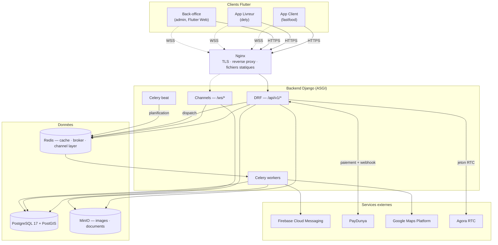
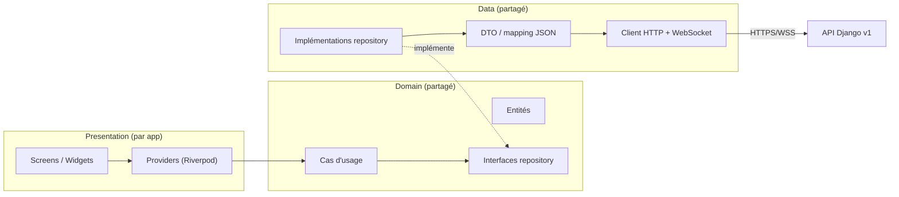

# Phase 6 — Migration Flutter vers l'architecture Django v2

**Statut** : **Supabase retiré des trois applications** (2026-08-01) — `fastfood`, `dely` et `admin` ne parlent plus qu'au backend Django ; `supabase_flutter` a quitté les trois `pubspec.yaml`. Reste le déploiement réel (§3.6) et la validation de bout en bout (§3.7). · **Entrée** : [02 — Architecture générale](02-architecture-generale.md), [ADR-009](adr/009-contrat-d-api.md)

---

## 1. Contexte et décision

Le backend (`backend/`) porte aujourd'hui l'intégralité du chemin critique et des domaines
secondaires (18 apps, chemin critique + fidélité, gamification, social, support, analytics,
abonnements — voir [README](README.md#avancement)). **Il ne reste que la Phase 6.** Les trois
applications Flutter (`apps/fastfood`, `apps/dely`, `apps/admin`) n'ont en
revanche subi aucune migration : elles lisent et écrivent encore directement dans Supabase
(Auth, Postgres, Realtime, Storage), plus un canal Socket.IO résiduel côté `fastfood`.

**Décision actée pour cette phase : rupture nette, pas de coexistence.** ADR-009 envisageait une
bascule domaine par domaine avec les apps continuant d'attaquer Supabase pour les domaines non
encore migrés le temps de la transition. Ce n'est plus la voie retenue : **Supabase n'est plus
utilisé du tout** dès que ce plan est engagé. Chaque domaine migré au fil de ce plan supprime son
code Supabase correspondant au lieu de le laisser vivre à côté ; il n'y a pas de double lecture
transitoire ni de synchronisation entre les deux backends.

Conséquence directe : aucune migration de données de production Supabase n'est nécessaire (pas
d'utilisateurs réels à reprendre) — c'est un démarrage à froid sur le backend Django.

---

## 2. Plan architectural cible

### 2.1 Vue d'ensemble

Principe directeur inchangé (ADR déjà actés) : **le backend est la seule autorité métier, Flutter
est un client.** Aucune app Flutter n'a d'accès direct à une base de données après cette phase —
ni Postgres (Supabase), ni règle métier dupliquée côté client.

### 2.2 Couches côté client — Clean Architecture

Chaque app adopte la même stratification, alimentée par un module Dart partagé (§3.1) :

- **Presentation** reste propre à chaque app (écrans très différents entre client, livreur,
  back-office) — c'est la seule couche non partagée.
- **Domain** et **data** sont partagés au maximum : c'est la réponse structurelle à la duplication
  déjà identifiée (~130 fichiers de services entre les 3 apps, dont une trentaine de quasi-doublons
  — Phase 1 §7).

### 2.3 Contrat d'API à respecter côté client (ADR-009)

La couche `data` du module partagé doit implémenter, dès le départ, les règles du contrat propre —
c'est justement l'occasion actée par ADR-009 de lever les trois travers de l'ancien client Dart :

| Règle | Détail |
|---|---|
| Versionnement | `/api/v1/...`, jamais d'URL non versionnée |
| Liste paginée | `{count, next, previous, results}` — plus de lecture à la racine (`current_page`/`last_page`) |
| Erreurs | `application/problem+json` (RFC 9457) ; le client teste `code`, jamais `detail` (traduisible, changeant) |
| Dates | ISO 8601 UTC, garanties non nulles quand déclarées ainsi dans le schéma OpenAPI — plus de `DateTime.parse` sans garde |
| Montants | objet `{"amount": "...", "currency": "XOF"}`, jamais un float |
| Idempotence | en-tête `Idempotency-Key` obligatoire à générer côté client sur la création de commande et l'initiation de paiement |
| Documentation | schéma OpenAPI généré (`drf-spectacular`), servi sur `/api/v1/schema/` et publié comme artefact CI (`contrat`) — s'en servir comme source de vérité pour les DTO, éventuellement génération de code |

---

## 3. Ce qu'il faut faire

### 3.0 Prérequis backend (avant d'ouvrir le chantier Flutter)

- [x] **Chat WebSocket + tableau de bord restaurant construits** (2026-07-27) : `ws/orders/<id>/chat/`
      (`OrderChatConsumer`, relais non persisté client ↔ livreur) et
      `ws/restaurants/<id>/dashboard/` (`RestaurantDashboardConsumer`, lecture seule, diffusé par
      `OrderService.transition_to` en plus du suivi client). Testés (autorisation à la connexion,
      relais, non-fuite entre établissements) ; suite complète (875 tests), ruff et mypy verts.
- [x] **FCM validé contre un vrai projet Firebase** (2026-08-05, projet `elcorazon-9595`).
      Le connecteur `apps/notifications/fcm.py` n'avait jamais été exercé contre le service réel.
      Il l'est ; détail complet dans `docs/firebase.md` §5.
      - **La validation a trouvé un défaut qui rendait le push totalement muet.** Le connecteur
        importait `google.auth.transport.requests` pour rafraîchir son jeton OAuth, donc le paquet
        `requests` — absent des dépendances, et absent **par choix** (`httpx` a été retenu pour son
        transport simulable). L'`ImportError` se produit avant tout envoi : `send()` l'attrape,
        journalise `fcm.authentification` et rend tous les appareils en échec passager. Aucune
        notification ne serait jamais partie, l'historique se serait rempli normalement, et le seul
        symptôme aurait été « les téléphones ne sonnent pas ». Le défaut a échappé aux tests parce
        qu'ils court-circuitaient `_authorization` — la seule ligne qui échouait. Corrigé par
        `_TransportOAuth`, transport `google-auth` bâti sur httpx (point d'extension documenté par
        la bibliothèque) ; 4 tests couvrent désormais ce chemin.
      - **Authentification, projet et URL acceptés** : jeton OAuth obtenu avec la portée
        `firebase.messaging`, l'API répond sur `/v1/projects/elcorazon-9595/messages:send`, et
        `send_test_push` passe bien par `backend()` — le chemin de production.
      - **Les codes de refus observés sont ceux que `ERREURS_DEFINITIVES` classe** : jeton tronqué
        → `400 INVALID_ARGUMENT`, jeton inexistant → `404 UNREGISTERED`, tous deux dans la liste et
        classés définitifs. Aucun code inconnu, aucun appareil sain classé définitif.
        `SENDER_ID_MISMATCH` n'a pas pu être provoqué (il demande un jeton d'un autre projet) et
        reste dans la liste à dessein.
      - **Reste, et cela demande un appareil physique** : la livraison réelle sur un téléphone, et
        le parcours métier application fermée (commande → worker Celery → notification).
      - **iOS n'est pas configuré** : aucune des deux applications ne porte de
        `GoogleService-Info.plist`, le `flutterfire configure` n'a couvert qu'Android. Sans lui ni
        clé APNs, l'API v1 accepte l'envoi et l'iPhone ne reçoit rien — le mode d'échec le plus
        trompeur de FCM. Seul Android est en état de recevoir (voir `docs/firebase.md` §7.2).
- [x] **MinIO validé en conditions réelles** (2026-07-27) : `default_storage.save()` contre une
      instance MinIO locale réelle (`docker compose up -d minio`, bucket `elcorazon` créé), lecture
      via l'URL signée générée par `default_storage.url()` (200, contenu identique), accès direct
      sans signature refusé (403 — confirme que le stockage n'est pas public par défaut,
      `AWS_QUERYSTRING_AUTH=True`), suppression confirmée. Le connecteur S3/MinIO fonctionne tel que
      configuré.
- [x] **CI GitHub confirmée verte** (2026-07-27) : le run déclenché par le remote configuré la
      veille avait en réalité échoué (`makemigrations --check` — Meta.ordering ajouté sur
      `Achievement`/`Badge` sans migration générée) ; migration `0002_alter_achievement_options_
      alter_badge_options` ajoutée, run suivant `success` (`.github/workflows/backend-ci.yml`).

### 3.1 Fondations Flutter partagées

- [x] **Package `packages/elcorazon_core/` créé** (2026-07-27), dépendance locale
      (`path: ../packages/elcorazon_core`) — borné à ce que l'authentification exige, pas plus :
  - `network/api_client.dart` — `Dio`, intercepteur JWT, **rafraîchissement single-flight** sur 401
    (un verrou partagé — `Future<String>? _refreshInFlight` — garantit qu'un seul appel à
    `/auth/token/refresh/` part même si plusieurs requêtes échouent en même temps ; le refresh token
    est à usage unique côté serveur, rotation + liste noire), mapping `problem+json` → `ApiException`
    typée par `code`.
  - `auth/token_storage.dart` — adapté de `apps/fastfood/lib/services/secure_token_storage_service.dart`
    (construit mais jamais branché côté Supabase — récupéré plutôt que réécrit).
  - `auth/auth_repository.dart` — register/login/refresh/logout/me/changePassword/registerDevice.
  - `auth/session.dart` — `sessionProvider` (Riverpod `AsyncNotifier<User?>`), porte la garde de rôle
    par type de compte (`allowedUserType`, vérifiée après `login()` **et** `restoreSession()`).
  - `models/user.dart` — classe à la main (pas de freezed/json_serializable : aucun des deux n'est
    utilisé ailleurs dans les 3 apps malgré leur présence en dépendance).
  - **Étendu domaine par domaine depuis** (2026-07-28/29), un module par domaine migré :
    `catalog/` (dont `review.dart` — les avis vivent sous `/catalog/reviews/`), `geography/`,
    `cart/`, `orders/`, `payments/`, `profile/`, `loyalty/`, `gamification/`, `social/`,
    `support/`, `notifications/`, `realtime/` (client WebSocket générique avec reconnexion,
    utilisé par le suivi de commande), `delivery/` (affectations, dossier livreur, et
    `assignment_offer.dart` — la charge utile de `delivery.offered`) et `tracking/` (relevés de
    position).
  - **Pas encore construit** : aide upload/lecture signée MinIO (§3.4).
  - Testé (87 tests, `flutter test` + `flutter analyze` verts) : parsing du contrat de chaque
    domaine, `TokenStorage`, et surtout la concurrence de rafraîchissement (`ApiClient —
    rafraîchissement sur 401`, simulée par un faux serveur puisqu'un vrai test de course en
    conditions réelles n'est pas fiable). Les tests de repository vérifient autant ce que le client
    **n'envoie pas** (`is_public`, `is_verified_purchase`, compteurs, identifiants d'utilisateur)
    que ce qu'il lit — c'est là que se joue le respect de C1/S1.
- [ ] Chaque app ne garde en propre que sa couche `presentation/` et les repositories spécifiques
      à ses écrans (ex. gestion de flotte côté `admin`, navigation GPS côté `dely`).

### 3.2 Authentification (fondation commune, transverse aux 3 apps)

- [x] **`dely` branché sur Django** (2026-07-27), **`fastfood` branché sur Django** (2026-07-28) —
      voir §3.3. `admin` suit le même patron, pas encore fait.
- [x] Décision prise en session : **Riverpod introduit, mais seulement pour la couche auth/session**
      — le reste de l'état de chaque app (panier, catalogue, tracking...) reste sur
      Provider/ChangeNotifier jusqu'à ce que son propre domaine soit migré. Les deux cohabitent via
      `UncontrolledProviderScope` (un `ProviderContainer` créé une fois dans `main()`) plutôt qu'une
      réécriture complète de la gestion d'état — voir `apps/dely/lib/main.dart` et
      `AppService._onSessionChanged` (le pont qui recopie `sessionProvider` dans `_currentUser`).
- [x] Migrer la gestion de session (accès + refresh rotatif, révocation) — fait pour `dely`.
- [ ] Aligner le modèle de rôles/permissions client sur ADR-005 (le back-office n'est plus la
      barrière d'autorisation, seulement un confort d'affichage — le serveur refuse de toute façon).
- [x] **Écart de périmètre découvert en construisant `dely`, désormais comblé** : le backend n'avait
      aucun endpoint pour créer un compte livreur (`/auth/register/` ne crée que des `customer` ;
      `apps/delivery` n'exposait les profils livreurs qu'en lecture). Tranché en session le
      2026-07-29 : **provisioning par le personnel**, pas de self-service. Un livreur ne s'inscrit
      pas, parce que son dossier le rattache à un établissement et que personne ne s'attribue un
      rattachement à soi-même. D'où `POST /api/v1/delivery/couriers/`, sous la permission
      `couriers.write` (distincte de `couriers.read` : lire la flotte ne donne pas le droit
      d'embaucher) et sous `assert_in_scope` — on n'embauche pas pour un établissement hors
      périmètre. Le compte naît `courier` + dossier `pending` : embaucher ne vaut pas valider, aucune
      pièce n'ayant encore été lue. `registerDriver*` peut donc quitter `dely` et son code Supabase
      être retiré (l'accès avait déjà disparu de l'écran de connexion).

### 3.3 Migration domaine par domaine

Ordre retenu par app, du risque le plus faible (lecture seule) au plus élevé (argent, temps réel) :

**`fastfood` (client)**
1. [x] Auth — connexion, inscription, déconnexion, restauration de session, garde de rôle
   `customer` (2026-07-28). Contrairement à `dely`, l'inscription **est** migrée : le backend crée
   toujours un `customer` par conception, ce qui correspond exactement à cette app. OTP
   téléphone, Google OAuth et « mot de passe oublié » retirés de l'écran de connexion (aucun des
   trois n'a d'équivalent côté Django — décision prise en session : email + mot de passe
   seulement pour l'instant). Même prudence que `dely` : seuls `login`/`register`/`logout`/
   `_loadUserSession` touchés dans `AppService`, `DatabaseService` intact. Deux fichiers dès lors
   totalement morts supprimés (`secure_token_storage_service.dart`,
   `README_SECURE_TOKEN_STORAGE.md` — construits pour Supabase, jamais branchés, remplacés par le
   `TokenStorage` du package partagé qui en reprenait déjà la base) ; `otp_verification_screen.dart`
   et la route associée laissés en place mais inatteignables, comme le fait `dely` pour son écran
   d'inscription.
2. [x] Géographie / restaurants / catalogue (2026-07-28) — `DjangoMenuRepository` implémente
   l'interface `MenuRepository` existante et traduit vers les modèles locaux, si bien que les
   écrans n'ont pas bougé ; `supabase_menu_repository.dart` supprimé. Pas de WebSocket catalogue
   prévu : `watchMenuItems` garde le polling 30 s de l'implémentation précédente.
3. [x] Panier serveur (`carts`, 2026-07-28) — `CartService` synchronise contre `/carts/`.
4. [x] Commandes (`orders`, 2026-07-28) — `DjangoOrderRepository.createFromServerCart()` crée la
   commande **depuis le panier serveur**, avec `Idempotency-Key` généré par le client ; les deux
   méthodes de l'interface locale qui n'ont pas d'équivalent au contrat (`createOrder` depuis un
   `Order` construit côté client, `updateOrderStatus` réservé au personnel) ne sont implémentées
   que pour satisfaire l'interface. `supabase_order_repository.dart` supprimé. Le code promo est
   transmis à la création et validé par le serveur ; en revanche `PromoCodeService` reste un
   catalogue en stockage local (voir l'écart plus bas).
5. [x] Paiements (`payments`, 2026-07-28) — `eccore.PaymentRepository` et `CheckoutInstruction`
   dans `payment_screen.dart` ; plus de paiement simulé côté client.
6. [x] Suivi temps réel (2026-07-28) — `eccore.RealtimeChannel` (reconnexion avec repli
   exponentiel, une fermeture 4403 ne retente pas) sur `ws/orders/<id>/tracking/`, consommé par
   `RealtimeTrackingService`.
7. [x] Fidélité et gamification (2026-07-28), **support et avis produits (2026-07-29)** :
   - `loyalty` — solde, catalogue de récompenses et journal viennent du serveur ; un point ne
     s'obtient qu'à la livraison, jamais par un calcul client.
   - `gamification` — badges Django (`isUnlocked`/`unlockedAt` servis, plus recalculés) ; les
     achievements et défis restent simulés côté client, faute d'écran qui les affiche.
   - `support` — tickets, fil de messages, réclamations et retours sur `/support/*`.
     `support_screen.dart` chargeait sa liste… jamais : l'appel manquait, la liste était donc
     vide en permanence quel que soit le backend ; corrigé au passage. Catégories alignées sur
     `TicketCategory` (« Général » n'existe pas côté serveur, remplacé par « Autre »).
   - **avis produits** — `/catalog/reviews/`. Trois choses que le client faisait disparaissent :
     calculer la moyenne des notes (elle vit sur l'article), deviner l'achat vérifié (le serveur
     le décide, S1), et transformer un second avis en modification (`upsert` → le serveur refuse,
     un avis par article et par personne, S5).
   - **social — pas migré**, voir l'écart de périmètre plus bas.
8. [x] Notifications (2026-07-29) — deux moitiés :
   - **historique** migré sur `/notifications/` (liste paginée, `unread-count` en route dédiée,
     marquage lu unitaire et global). L'écriture depuis le client disparaît entièrement : plus de
     `saveNotification` ni de famille `sendWelcomeNotification`/`sendPromotionNotification`, et
     plus de suppression (le contrat ne l'expose pas — le serveur décide seul de la durée de vie
     d'une notification). Les entrées correspondantes de l'écran ont été retirées.
   - **push FCM construit** : `firebase_core`/`firebase_messaging` ajoutés, permission, jeton
     d'appareil enregistré auprès de `/auth/devices/` après connexion et retiré **avant** la
     déconnexion (l'endpoint exige la session qu'on ferme), ré-enregistrement sur rotation du
     jeton (`onTokenRefresh` — sans quoi l'appareil cesse de recevoir en silence), affichage au
     premier plan et handler d'arrière-plan. ⚠️ `lib/firebase_options.dart` ne contient que des
     **valeurs de remplissage** : aucun projet Firebase n'existe encore (§3.0). L'initialisation
     est donc non bloquante — l'app démarre sans push plutôt que de refuser de se lancer. Même
     état que `dely`. La configuration Android/iOS (`google-services.json`, plugin Gradle,
     `GoogleService-Info.plist`) reste à faire en même temps que le vrai projet.

✅ **Commande groupée — l'écart est comblé côté backend** (2026-07-30). L'alternative posée le
2026-07-29 (« construire ou retirer ») est tranchée : construite, dans une app dédiée
`apps/groupcarts`. Ce qui existe désormais :

- `GroupCart` / `GroupCartMember` / `GroupCartLine` — un panier partagé par établissement, ouvert par
  un **hôte**, rejoint par **code d'invitation** à six caractères (alphabet sans `O`/`0` ni `I`/`1`,
  parce qu'un code se lit à voix haute), avec **échéance obligatoire** (2 h par défaut, `GROUP_CART_*`
  en réglage). Trois principes, chacun réponse à un défaut de l'existant Supabase :
  **(1)** le panier n'est **pas** une commande — aucune `Order` n'existe avant confirmation, là où
  `group_order_screen.dart` écrivait dans `orders`/`order_items` dès l'ouverture ;
  **(2)** une ligne **appartient à celui qui l'a déposée** — `member` est la clé du droit d'écriture,
  pas une donnée d'affichage, alors que l'abonnement Realtime donnait à tous l'écriture sur les mêmes
  lignes ; **(3)** aucun montant n'est stocké (C1).
- `POST /api/v1/group-carts/` (ouvrir) · `join/` (par code) · `{id}/lines/` (déposer, modifier,
  retirer) · `{id}/lock/` (clore les ajouts) · `{id}/confirm/` (→ **une** commande) · `{id}/cancel/`.
  L'appartenance est un **filtre** et non une permission : le panier d'un groupe étranger est
  introuvable, pas interdit — un 403 confirmerait son existence.
- `ws/group-carts/{id}/` — synchronisation temps réel, autorisée **avant** l'acceptation du socket sur
  l'appartenance réelle (ADR-008). Lecture seule : les contributions passent par HTTP, qui valide
  l'article, ses options et l'échéance. C'est le point exact où l'ancienne version ne validait rien.
- La confirmation emprunte `OrderService.create_from_selection`, extrait de `create_from_cart` pour
  l'occasion : même relecture des prix, même décompte de stock sous verrou, même barème de zone, même
  évaluation du code promo. De même, la valorisation passe par `price_selection`, désormais partagée
  avec le panier personnel via le protocole `PriceableLine`. **Aucun second chemin de calcul** — c'est
  ainsi que les frais de livraison de l'implémentation précédente avaient fini par être calculés deux
  fois différemment.
- Pas d'en-tête d'idempotence sur `confirm/`, contrairement à `POST /orders/`, et ce n'est pas un
  oubli : le panier **est** la clé. Un second appel trouve un statut `confirmed` et la machine à états
  refuse la transition ; deux appels simultanés sont sérialisés par `select_for_update`.
- Tâche `expire_group_carts` toutes les 5 min. L'échéance est déjà opposée à chaque ajout, donc rien
  d'incorrect ne passe entre deux tours ; la tâche sert à *dire* au groupe que c'est terminé.
- 54 tests (`tests/groupcarts/`) : API, machine à états exhaustive, WebSocket.

**Reste côté Flutter** : réécrire `group_order_screen.dart` (2867 lignes) et la partie « commandes de
groupe » de `SocialService` contre ces endpoints, puis retirer le code Supabase correspondant.

- **Groupes sociaux et publications** — le repository partagé existe et est testé
  (`elcorazon_core/social/`), mais le seul écran qui consomme les groupes est celui de la commande
  groupée : le branchement suit sa réécriture.

⚠️ **Écarts de périmètre restants côté `fastfood`** (aucun endpoint Django équivalent) :
- **Notation du livreur** (`DriverRatingService`) — `rating_average`/`rating_count` sont en lecture
  seule sur le profil livreur, rien ne permet de déposer une note. Reste sur Supabase.
- **« Avis utile »** — `helpful_count` est servi mais aucun endpoint ne l'incrémente ; le bouton et
  le tri correspondants ont été retirés.
- **Photos d'avis** — absentes du contrat, retirées de l'affichage.
- **Codes promo** — la validation à la création de commande est bien serveur ; en revanche
  `PromoCodeService` reste un catalogue en stockage local, sans équivalent lu depuis
  `/promotions/`. `promo_code_service_supabase.dart` (aucun appelant) a été supprimé.

**`dely` (livreur)**
1. [x] Auth — connexion, déconnexion, restauration de session, garde de rôle `courier` (2026-07-27).
   Inscription **non migrée** (voir l'écart de périmètre en 3.2) ; `loginDriver`/`logout`/
   `initialize()` seuls touchés dans `AppService` — `DatabaseService` n'a volontairement pas été
   modifié (les appels Supabase pour les domaines pas encore migrés, ex. `updateUserOnlineStatus`,
   restent inertes pour un compte Django tant que le domaine livraison n'a pas son tour, plutôt que
   de risquer une régression en touchant un fichier de 1000+ lignes hors du périmètre auth).
   `AppService.login()` (chemin Supabase) a depuis été supprimé (2026-07-29) : il n'avait plus
   aucun appelant et ouvrait le suivi temps réel sur une identité inconnue du backend.
2. [x] Affectation et gestion des courses (`delivery`, 2026-07-29) — `DjangoDeliveryRepository`
   assemble une `Course` (l'affectation Django + la commande qu'elle porte, traduite vers le
   modèle local) : les écrans continuent de raisonner en commandes alors que **toutes les actions
   s'adressent à la course**. Deux choses que faisait l'app Supabase disparaissent, et ce sont
   les deux qui comptent :
   - **le vivier de commandes à se partager n'existe pas**. Le personnel propose une course à un
     livreur nommé (`AssignmentService.offer`) ; « disponible » veut désormais dire « proposée à
     moi ». L'acceptation est exclusive côté serveur (L2), rien n'est donc affiché comme acquis
     avant la réponse ;
   - **le client n'écrit jamais le statut de la commande**. Il fait avancer la course, la commande
     suit par projection serveur (`ORDER_STATUS_PROJECTION`) — c'est une projection écrite à la
     main côté client qui avait produit C4. Les boutons affichés viennent d'`allowedTransitions`,
     la machine à états n'est pas rejouée. L'éligibilité se lit sur le dossier
     (`canAcceptOrders`, L1), elle ne se recompose pas depuis « en ligne ».
3. [x] Émission de position (2026-07-29) — **par HTTP (`/tracking/assignments/{id}/pings/`), pas
   par le WebSocket** : `ws/couriers/me/` (`CourierFeedConsumer`) est une file de propositions en
   **lecture seule**, rien n'y remonte. Ce point du plan était donc faux, et c'est le contrat qui
   tranche : la file sert à recevoir des courses, les relevés partent en HTTP. Un relevé perdu
   n'est pas relancé (c'est le suivant qui compte) ; la cadence est de 10 s, celle qu'attend
   `TrackingPingThrottle`, le serveur écartant lui-même tout relevé à moins de
   `TRACKING_MIN_WRITE_METERS` du précédent (202, qui n'est pas un échec).
   Deux corrections de fond au passage :
   - **l'émission suivait un écran**, `real_time_tracking_screen.dart` : fermer la carte
     suffisait à disparaître du suivi. Elle vit désormais le temps de la session, portée par
     `AppService` — la boucle GPS de `RealtimeTrackingService` n'émettait quant à elle
     strictement rien (un `debugPrint`, jamais d'appel réseau) ;
   - **la file des courses n'était pas consommée du tout** : un livreur ne découvrait une course
     qu'au rechargement suivant, alors que c'est le seul flux où rater un message a un coût
     métier direct (ADR-008). `ws/couriers/me/` est branché, et une proposition déclenche le
     rechargement de la liste — le message alerte, l'API fait autorité.
   `supabase_realtime_service.dart` (façade Supabase Realtime, seul appelant de ce service) est
   supprimé ; `RealtimeTrackingService` ne transporte plus que du Django.
4. [x] Jeton FCM enregistré via `AuthRepository.registerDevice()` après connexion (2026-07-27) —
   best-effort, ne bloque pas la connexion en cas d'échec. Cycle de vie complété le 2026-08-05,
   à parité avec `fastfood` : `NotificationService` expose `tokenRefreshStream` (FCM renouvelle
   le jeton de son propre chef — sans ré-enregistrement, le livreur cesse de recevoir ses offres
   de course en silence) et la déconnexion détache l'appareil du compte. Sans ce second geste, un
   téléphone partagé entre deux tournées continuait de recevoir les offres du livreur précédent.
5. [x] Clés Supabase codées en dur retirées de `api_config.dart` (2026-07-27) — la clé Google Maps,
   elle, reste (toujours utilisée par 3 services non liés à Supabase).

**`admin` (back-office)** — **migré** (2026-08-01)

1. [x] Auth + permissions sur `sessionProvider` (`expectedUserTypeProvider = staff`). Le
   provisioning de comptes tiers passe par `POST /delivery/couriers/` et
   `/restaurants/staff/` : `auth.admin.createUser(...)` n'avait aucune garde de permission.
2. [x] Catalogue — articles, catégories, groupes d'options, stock (`/catalog/manage/*`).
3. [x] Supervision commandes et flotte (`/orders/manage/`, `/delivery/couriers/`).
4. [x] Clients, rôles et permissions (`/administration/*`), promotions (`/promotions/`).
5. [x] Analytics et rapports (`/analytics/reports/*`), campagnes (`/notifications/campaigns/`),
   fidélisation (`/gamification/manage/*`, `/loyalty/manage/rewards/`).
6. [x] Zones (`/geography/manage/zones/`), planning et dossiers livreurs (`/delivery/shifts/`,
   `/delivery/couriers/`), recherche transverse (`/search/`), paiements et remboursements
   (`/payments/`).

**Neuf trous fermés au passage.** Ils ne sont pas des détails d'implémentation : chacun était
exploitable depuis un poste de travail.

| Ce que faisait l'app | Conséquence |
| --- | --- |
| Quatre **clés marchandes PayDunya** dans `SharedPreferences`, appels directs au prestataire | Un remboursement déclenchable sans permission, sans rattachement, sans trace, sans plafond |
| **Recherche globale** sur quatre tables, sans permission ni cloisonnement | Un opérateur de Kara lisait les commandes de Lomé ; un compte privé de `customers.read` lisait des téléphones clients |
| **Documents livreurs** dans un compartiment de stockage **public** | Une pièce d'identité lisible indéfiniment par qui connaissait l'URL |
| **Rôles admin** appliqués côté interface seulement | Un « Opérateur » privé du module marketing appelait l'API marketing sans obstacle |
| **Crédit de points de fidélité** depuis le back-office | Le back-office frappait monnaie ; le journal des points ne disait plus d'où venait un solde |
| **Édition du profil client** par dictionnaire libre | `email` y passait — chemin de reprise de compte par « mot de passe oublié » |
| **`used_count` d'un code promo** inscriptible | Un quota épuisé se rouvrait sans que rien n'en garde trace |
| **Barème de livraison** en dur dans le client, deux constantes contradictoires | Les frais annoncés dépendaient du fichier consulté |
| **Notification de masse** ajoutée à une liste en mémoire | « Notification envoyée » s'affichait ; personne ne recevait rien |

**Sept endpoints construits** pour ce que le back-office faisait sans serveur : fiche client
agrégée (`/analytics/reports/customers/{id}/`), rapports du tableau de bord (statuts, catégories,
chiffres de tête), catalogues de fidélisation (succès, badges, défis, récompenses), planning
livreur (`CourierShift` — **indicatif**, L1 inchangé), recherche transverse (app `apps/search`),
bibliothèque d'options réutilisables (`OptionTemplate`, qui **copie** au lieu de référencer), et
`option_groups` sur la forme back-office d'un article.

**Ce qui a été retiré faute d'équivalent, et parce que ça ne tenait pas** : la validation
document par document (on approuvait le permis et rejetait la carte grise — le compte restait
dans un état illisible), les dates d'expiration de pièces (saisies à la main, vérifiées seulement
si quelqu'un ouvrait le bon écran), l'historique de validation (écrit depuis le navigateur, avec
l'auteur que le client déclarait), les prévisions de vente et le « risque d'attrition » (moyennes
pondérées calculées dans le navigateur, avec un « niveau de confiance » qui ne mesurait rien), le
filtre VIP (croisant des badges et des commandes de deux moments différents) et le calcul de
remise côté client (C1 : le serveur est seul à chiffrer une remise).

**Beaucoup de code injoignable** est parti avec : `main_web.dart` (second point d'entrée
qu'aucune configuration de build ne référence), les écrans client restés dans le back-office
(`auth_screen`, `home_screen`, `splash_screen`, `screens/client/`), les deux widgets de suivi
temps réel, et six services sans appelant. `app_service.dart` est passé de 600 à 140 lignes : il
portait la connexion et l'inscription de **clients**, un panier et le passage de commande — et
fabriquait un administrateur fictif (UUID nul) quand aucune session n'était trouvée.

Pour chaque domaine : (a) consulter le schéma OpenAPI du domaine, (b) écrire le repository Dart
contre ce contrat, (c) remplacer l'appel Supabase existant dans les providers/services, (d)
supprimer le code Supabase mort immédiatement (pas de code mort transitoire — cf. §1), (e) valider
le parcours manuellement.

### 3.4 Flux externes à rattacher

- [x] **Agora — fait** (2026-07-31) : `apps/calls` porte la signalisation, `common/agora.py` la
      délivrance du jeton, `ws/me/` la sonnerie. Le flux média reste en pair-à-pair chez Agora,
      seul le jeton vient de l'API (`API -->|jeton RTC| RTC`, §2.1). Voir §3.5 pour le détail.
- [x] **Stockage — arbitré et construit** (2026-08-05, **ADR-011**). Le chapitre était resté ouvert
      avec MinIO validé techniquement mais aucune décision écrite sur ce qui va où. La formulation
      d'origine — « tout passe par des URL signées » — était d'ailleurs le problème, pas la
      solution :
      - **Deux familles de fichiers, deux traitements.** Signer une image de catalogue la fait
        expirer en quinze minutes : aucun cache ni CDN ne peut s'y accrocher, chaque affichage de
        menu regénère autant de signatures que de vignettes, et une carte mise en favori montre des
        cadres vides le lendemain. Les médias publics (`products`, `banners`, `users`) sont donc
        servis par des URL **stables et sans signature** ; seuls les documents (`documents` —
        pièces d'identité, permis, cartes grises, preuves de livraison) passent par des URL signées
        et expirantes.
      - **La visibilité est portée par le compartiment**, pas par un contrôle applicatif : une
        politique de lecture se pose sur un compartiment et non sur un préfixe, ce qui rendait la
        frontière inexprimable avec le compartiment unique de départ. Les publics reçoivent
        `s3:GetObject` et rien d'autre — ni `ListBucket`, qui publierait l'inventaire, ni
        `PutObject`. Le privé ne reçoit aucune politique : sans elle, S3 refuse tout ce qui n'est
        pas signé.
      - **`STORAGES["default"]` est le compartiment privé.** Un champ fichier ajouté demain sans
        stockage explicite atterrit dans le signé : l'oubli ferme au lieu d'ouvrir.
      - **Une seule porte** — `common/storage.py`. Aucun autre module n'importe `boto3`,
        `botocore` ni `storages` ; un test inspecte l'AST de chaque module pour le vérifier. Le
        service porte dépôt, suppression, URL publique, URL signée (lecture **et** envoi direct) et
        création des compartiments.
      - **Les compartiments se créent seuls** : `ensure_storage_buckets`, idempotente, appelée au
        démarrage de l'API en développement comme en production. Un stockage injoignable fait
        échouer le démarrage plutôt que le premier envoi d'un utilisateur.
      - **Rien n'est écrit en dur** : point d'accès, région, identifiants, TLS, style d'adressage et
        les quatre noms de compartiment viennent de l'environnement. Passer sur AWS S3 est une
        modification de `.env`.
      - Corrigé au passage : `file_overwrite = False`. Avec le défaut de `django-storages`, deux
        clients envoyant chacun un `photo.jpg` comme avatar auraient partagé le même objet — le
        second écrasant le premier, qui aurait vu la photo d'un inconnu sur son profil.

### 3.5 Nettoyage Supabase

- [x] **Terminé (2026-08-01).** `supabase_flutter`, `lib/supabase/` et toute clé/URL Supabase
      ont quitté les trois `pubspec.yaml` et les trois `.env`. Vérification : `grep -rn
      "package:supabase" */lib` ne rend plus rien.
- [x] Code Supabase devenu mort supprimé au fil des tranches : `supabase_menu_repository.dart`,
      `supabase_order_repository.dart`, `secure_token_storage_service.dart`,
      `social_features_service.dart` (672 lignes, aucun appelant),
      `promo_code_service_supabase.dart` (aucun appelant) et, côté `dely`,
      `supabase_realtime_service.dart` avec `AppService.login()`.
- [x] **`fastfood` ne dépend plus de Supabase** (2026-07-31) : `supabase_flutter` retiré du
      `pubspec.yaml`, `lib/supabase/` supprimé, clés `SUPABASE_*` retirées des `.env`. Les 27
      fichiers du départ sont à zéro. Dernière tranche, la signalisation d'appel :
      - **Nouvelle app `apps/calls`** : modèle `Call` et sa machine à états (quatre issues
        terminales, donc rejeu inexprimable — raccrocher deux fois ne compte pas deux durées),
        `CallService`, endpoints d'ouverture/décrochage/refus/raccrochage, historique, et
        délivrance du jeton RTC. 18 tests d'API, 5 de WebSocket.
      - **Le certificat Agora a quitté l'app.** Il vivait dans le `.env` Flutter, c'est-à-dire
        dans un binaire distribué : l'en extraire suffisait à fabriquer ses propres jetons et à
        rejoindre n'importe quel canal. Il signe désormais côté serveur
        (`common/agora.py`, format AccessToken2, 12 tests) et l'app ne reçoit qu'un jeton borné à
        un canal, un `uid` et une heure.
      - **Trois choses ne voyagent plus depuis le client** : le destinataire (déduit de la course
        — l'app fournissait `receiver_id`, donc n'importe quel compte pouvait faire sonner
        n'importe quel autre), le canal RTC (dérivé de l'appel côté serveur — l'app composait
        `order_{id}_call`, si bien que connaître une commande suffisait à rejoindre la
        conversation), et l'`uid` Agora (attribué par le serveur — l'app le tirait d'un hachage
        tronqué d'UUID, qui peut entrer en collision et expulser un participant du canal).
      - **Nouveau canal `ws/me/`** (`UserFeedConsumer`), seul canal du projet non rattaché à une
        ressource : un appel entrant doit joindre son destinataire où qu'il soit dans l'app, ce
        qu'un canal par commande ne permet pas.
      **Reste un lien vers l'ancien backend Node**, sans rapport avec Supabase :
      `geocoding_service`, `directions_service`, `places_service` et `paydunya_service` passent
      par un mandataire HTTP (`ApiConfig.backendUrl`, renommé `LEGACY_PROXY_URL`) — **sur le web
      uniquement**, pour contourner CORS sur les API Google. Aucun équivalent Django n'existe
      encore.
- [x] **`DatabaseService` supprimé** (2026-07-31, 2255 l) — plus aucun appelant. Avec lui
      disparaît le dernier accès direct à Postgres depuis l'app cliente. Dans la même passe :
      - **Paiement partagé migré** sur `payments/{order}/split/` (`SplitPayment`, `SplitShare`,
        `SplitParticipantInput` ajoutés à `elcorazon_core`, 5 tests). L'écran encaissait
        **depuis l'app** — il appelait PayDunya pour chaque convive avec le numéro et l'opérateur
        saisis par l'organisateur, puis écrivait lui-même « payé » : mentir à cette écriture
        soldait une part que personne n'avait réglée. Désormais chaque part porte un **lien**, le
        convive paie chez le prestataire (avec ou sans compte), et seul le webhook signé solde.
        Les champs téléphone/opérateur disparaissent : ils appartiennent à la page du
        prestataire, qui les demande au payeur — pas à l'organisateur, qui les saisissait pour
        les autres. Le partage du total est fait par le serveur, sans laisser d'unité mineure
        orpheline.
      - **Suivi de livraison migré** sur `tracking/orders/{id}/` : commande, livreur et dernière
        position viennent d'un seul appel. **L'historique complet du trajet n'est plus relu** —
        le contrat ne le porte pas volontairement (suivre son repas est un service, suivre un
        employé après coup n'en est pas un) ; la trace sur la carte est celle accumulée pendant
        la session, depuis le WebSocket.
      - **`finalizeExistingOrder` supprimé** : devenu injoignable une fois la commande de groupe
        née de `group-carts/{id}/confirm/`. C'était le dernier chemin où l'app écrivait le statut
        d'une commande et son paiement directement en base.
- [x] **Commande de groupe migrée** (2026-07-31) : `group_order_screen.dart` passe de 2867 à
      1359 lignes, `social_service.dart` (1382 l) et `group_delivery_service.dart` (736 l) sont
      supprimés, remplacés par `GroupCartService` (~280 l) au-dessus du repository. Trois écarts
      de comportement en découlent, tous imposés par le modèle v2 :
      - **L'onglet « Groupes à proximité » disparaît.** Le backend n'expose aucune découverte
        géographique de paniers : on rejoint par code, pas sur une carte. Tout le bloc (service,
        carte Google Maps, marqueurs, dialogue de détail) part avec.
      - **« Quitter le groupe » devient « fermer le panier », réservé à l'hôte.** Le contrat n'a
        pas de geste « quitter » : sortir un participant laisserait ses lignes derrière lui, à la
        charge de l'hôte. Un invité retire ses lignes ; l'hôte referme le panier pour tous.
      - **Les adresses e-mail des participants ne sont plus affichées** — le contrat ne les porte
        pas. La ligne montre désormais ce que chaque convive doit, lu dans `per_member`.
      Le reste suit le serveur : les totaux et la répartition par participant viennent de lui
      (l'app les additionnait et les divisait elle-même), une ligne devenue indisponible reste
      visible avec sa raison au lieu de disparaître, la confirmation est refusée si une ligne ne
      l'est plus, et les trois abonnements temps réel Supabase (commande, lignes, membres) sont
      remplacés par le seul `ws/group-carts/{id}/`, en lecture seule — l'ancienne version écrivait
      par le canal temps réel, sans validation nulle part.
- [x] **Panier collaboratif porté dans `elcorazon_core`** (2026-07-31) : `GroupCart`,
      `GroupCartLine`, `GroupCartMember`, `GroupCartMemberTotal` et `GroupCartRepository`
      (ouvrir, rejoindre par code, déposer/modifier/retirer une ligne, clore, confirmer,
      renoncer), 13 tests. C'est la fondation qui manquait pour réécrire
      `group_order_screen.dart` : le modèle v2 n'est pas celui de Supabase — un panier
      **éphémère** à code d'invitation, dont le serveur rend l'intégralité après chaque
      écriture (sous-total et totaux par participant compris), là où l'app répartissait
      elle-même les montants entre convives.
- [x] **`DatabaseService` vidé de ses consommateurs, sauf le bloc commande groupée** (2026-07-31).
      Il reste 12 fichiers Supabase dans `fastfood` (27 au départ), tous dans le même
      périmètre : commande groupée, paiement partagé, social, suivi de livraison, appels.
      Migrés dans cette tranche :
      - **`CustomizationService`** → groupes d'options du détail d'article
        (`MenuItemDetailSerializer`). `OptionGroup`/`Option` ajoutés à `elcorazon_core`. Le
        préchargement global de toutes les personnalisations disparaît : le contrat ne les porte
        que sur le détail, à dessein.
      - **`GamificationService`** (832 → 373 l) → **lecture seule**. `upsertUserAchievement`,
        `upsertUserChallenge`, `updateUserLoyaltyPoints`, `createLoyaltyTransaction` et
        `addPoints` supprimés : le client se déclarait ses succès débloqués et se créditait les
        points correspondants. Progression et déblocage sont calculés par le serveur à la
        livraison ; `onOrderPlaced` ne fait plus que redemander l'état.
      - **`AppService`** : `placeOrder` (chemin Supabase mort, totaux calculés côté client),
        `updateOrderStatus`, `addMenuItem`/`updateMenuItem`/`deleteMenuItem` supprimés — gestes
        du personnel, sans appelant. Le crédit de points après commande disparaît aussi.
        `trackEvent` → `/analytics/events/` (nouveau `AnalyticsRepository` ; l'auteur vient du
        jeton, plus d'un `user_id` déclaré par le client).
      - **`OfflineSyncService`** : la file panier rejoue sur le panier Django (sans frais,
        remise ni code promo — le serveur les recalcule) ; les files « commandes » et « profil »
        sont supprimées, plus aucun producteur ne les alimentait.
      - **`AdvancedSearchService`** → filtres serveur (voir ci-dessous) ; **`ChatService`** →
        `ws/orders/{id}/chat/` (relais non persisté : plus d'historique à recharger, et
        `RealtimeChannel.send()` ajouté au package) ; **`AIRecommendationService`** et
        **`cake_order_screen`** → `DjangoMenuRepository`. Cet écran **créait un article dans le
        catalogue** quand il manquait : le catalogue s'écrit depuis le back-office, le repli en
        mémoire (déjà présent) devient le comportement nominal.
      - Supprimés faute d'équivalent ou d'appelant : `promotion_service` + `promotion_banner`
        (le backend n'expose **aucune liste publique de promotions**, par décision explicite),
        `otp_verification_screen` (écran injoignable, et pas d'authentification par téléphone
        en v2).
- [x] **Options structurées portées jusqu'au panier — commande de gâteaux sur mesure**
      (2026-08-06). La tranche précédente laissait `CartRepository.addLine` envoyer
      `options: []` : la composition ne partait qu'en texte libre dans `notes`, et le
      configurateur compensait en déposant au panier un prix calculé dans l'application
      (`copyWith(price: base + suppléments)`). Ce prix ne franchissait pas la
      synchronisation — le serveur relit le catalogue (C1) — si bien que le client
      composait un gâteau à 45 000 F et en commandait un à 20 000 F.
  - `CartLine.options` (miroir de `SelectedOptionSerializer`) et `addLine(optionIds:)` ajoutés
    au package ; `CartItem.selectedOptionIds` persisté localement et rejoué par la file hors
    ligne. Le prix de la ligne redevient celui du catalogue, options comprises, côté serveur.
  - **Les contraintes viennent du groupe** (`min_select`/`max_select`), plus d'une table
    indexée par étiquettes locales (`shape`, `size`) que le serveur n'emploie pas — il groupe
    par nom (« Forme »). Aucune de ces règles n'était donc appliquée sur des options réelles :
    l'écart n'apparaissait qu'au refus de `validate_selection`.
  - **Le repli en mémoire n'est plus commandable.** Ses identifiants n'existent pas au
    catalogue ; la ligne était acceptée localement puis rejetée à la synchronisation. Pire,
    ce rejet survenait *après* le `clear` de `_replaceRemoteCart` et interrompait la boucle :
    un seul article invalide vidait le panier distant et emportait les suivants. La boucle
    poursuit désormais sur un refus 4xx et ne propage que les pannes.
  - Même correction appliquée à `item_customization_screen`, qui partageait le service et le
    défaut (prix local, et résumé lu **après** `finishCustomization`, donc toujours vide).
- [x] **Recherche avancée rendue au serveur** (2026-07-31) : `apps/catalog/filters.py`
      (`MenuItemFilter` — prix, calories, temps de préparation, note, régimes, allergènes,
      ingrédients), 12 tests. L'app composait la requête depuis le téléphone puis **filtrait la
      page reçue** : un article correspondant mais absent de cette page ne remontait jamais.
- [x] **Tranche « domaines sans équivalent backend » arbitrée** (2026-07-31). Trois zones de
      `fastfood` s'appuyaient sur Supabase sans contrepartie côté Django ; décisions prises en
      session :
      - **Notation du livreur → construite côté backend.** `CourierRating` (lien un-à-un avec la
        course), `CourierRatingService` avec moyenne incrémentale sous verrou, `GET|POST
        /delivery/orders/{id}/rating/`, migration `0003_courierrating`, 13 tests. Le client
        n'envoie plus que la note et le commentaire : le livreur vient de la course, l'auteur du
        jeton — l'ancienne version acceptait `driver_id` et `customer_id`, donc noter le livreur
        d'un autre. La moyenne affichée pendant le suivi est lue dans `tracking/orders/{id}/`, qui
        la portait déjà.
      - **Portefeuille → retiré.** `wallet_service.dart` (699 l), `wallet_screen.dart`, la route,
        les entrées de menu et le reliquat « repas gratuit VIP » de `CartService`. Aucun modèle de
        solde n'existe côté v2 ; `PaymentMethod.wallet` reste un moyen de paiement du backend et
        n'est pas concerné. Le droit **VIP** ne venait pas du portefeuille mais d'un abonnement :
        il est désormais lu sur `loyalty/subscriptions` (nouveau `SubscriptionService` côté app,
        `Subscription`/`SubscriptionPlan` + méthodes d'abonnement ajoutés à `elcorazon_core`).
        Le filtre des articles `vip_exclusive` ne dépend plus du **nom** du plan.
      - **Signalisation d'appel Agora → à construire côté backend** (voir §3.4, toujours ouvert).
- [x] **`MarketingService` supprimé** (2026-07-31, 1024 l) : enregistré comme provider et
      initialisé, mais aucun écran ne le consommait.
- [x] **Couche temps réel de `fastfood` migrée** (2026-07-31) : `supabase_realtime_service.dart`
      (591 l) et `realtime_sync_service.dart` supprimés. Ce dernier s'abonnait aux tables
      `menu_items` et `orders` **entières** ; le backend n'expose délibérément pas de canal
      catalogue, le menu est relu par `DjangoMenuRepository` et les commandes par
      `ws/orders/{id}/tracking/`. `RealtimeTrackingService` perd ses délégations d'écriture
      (statut, position, marquage livré) : ce sont des gestes du personnel ou du livreur, que le
      backend refuse à un compte client. Le widget `delivery_tracking_widget.dart` qui offrait au
      client un bouton « Marquer comme livrée » n'avait aucun appelant — supprimé.
- [x] **`NotificationService` réduit aux notifications locales** (2026-07-31) : sa liste
      d'historique et son abonnement à la table `notifications` faisaient doublon avec
      `NotificationDatabaseService` (déjà migré) — aucun écran ne les lisait. `ErrorHandlerService`
      traduit désormais `ApiException` (RFC 9457) au lieu de `PostgrestException`/`AuthException`.
- [x] **Canal Socket.IO résiduel retiré dans `fastfood`** (2026-07-31) : `socket_service.dart`,
      le `Provider` de `main.dart`, le getter d'`AppService` et la dépendance `socket_io_client`
      supprimés. Aucun écran n'enregistrait de callback (`onOrderUpdate`, `onDriverLocation`) : le
      service ne faisait plus que boucler sur `localhost:3000`, mort depuis l'abandon du backend
      Node. Le suivi temps réel passe par `ws/orders/<id>/tracking/` côté Django.
- [x] **Supabase retiré de `FormValidationService` et `FormManagerService`** (2026-07-31) : les
      deux plantaient au démarrage sur `Supabase.instance` (aucune clé en `.env`). Les contrôles
      d'unicité (email, téléphone, adresse, carte) étaient déjà inertes et incombent au backend ;
      les brouillons de formulaires sont désormais explicitement en mémoire seule.
- [x] **Frais de livraison et couverture rendus au serveur** (2026-08-05). Le suivi temps réel était
      migré depuis longtemps, mais tout ce qui touchait à la **géographie** restait calculé sur le
      téléphone — dernier morceau de l'invariant C1 encore ouvert dans `fastfood` :
      - **`DeliveryFeeService` ne calcule plus rien.** Il appliquait son propre barème (500 F de
        base, 200 F du kilomètre, franco à 10 000 F, plafond à 5 000 F, arrondi à la dizaine), sur
        une distance à vol d'oiseau mesurée depuis des coordonnées de restaurant écrites en dur.
        Aucune de ces valeurs n'existait côté serveur, qui facture depuis le barème de la
        `DeliveryZone` couvrant l'adresse d'arrivée : **l'écran annonçait un prix, la commande en
        retenait un autre**, et c'est le second que le client payait. Le service interroge
        désormais `GET /geography/zones/resolve/` (couverture et barème d'un point) et
        `POST /orders/preview/` (devis de la commande, même chemin de calcul que la création).
        `config/delivery_config.dart` supprimé.
      - **Deux ajouts au socle** : `GeographyRepository.resolveZone` + `ZoneResolution`, et
        `OrderRepository.preview` + `OrderQuote`. `POST /orders/preview/` existait côté serveur
        depuis la Phase 3 sans qu'aucune application ne l'appelle. 5 tests.
      - **`CartService` ne porte plus de frais par défaut.** Il démarrait à `500.0`, persistait le
        montant entre deux sessions et retombait sur `1000.0` en cas d'erreur — trois façons
        d'afficher un chiffre que personne n'allait facturer. Le panier porte maintenant le devis
        serveur (`refreshQuote`), invalidé à chaque modification, et l'écran dit « livraison
        calculée à la validation » tant qu'aucune adresse n'est choisie, au lieu d'un montant
        inventé.
      - **Deux positions de restaurant contradictoires** vivaient dans `fastfood` :
        `AppConstants` (Lomé, 6.1375/1.2123) et le sélecteur de carte (5.3599/-4.0083, soit
        Abidjan). Les cercles de couverture de cet écran étaient donc centrés à 600 km du
        restaurant. Ils sont retirés : une zone réelle est un contour souvent discontinu que
        PostGIS teste en base, pas un rayon, et le serveur ne rend pas le contour aux clients —
        c'est le repère lui-même qui porte la réponse, point par point.
      - **Corrigé au passage** : `DeliveryZone.fromJson` lisait `max_distance_km` comme un nombre
        alors qu'un `DecimalField` de DRF voyage en chaîne (plantait à la première zone reçue), et
        prenait la ville imbriquée de la route publique pour un identifiant.
- [x] **Faux suivi de livraison retiré des trois applications** (2026-08-05). Les trois
      `location_service.dart` portaient le même `startDeliveryTracking` : une minuterie locale qui
      faisait passer une commande de « en préparation » à « livré avec succès » en quarante
      secondes **sans rien demander à personne** — un client dont le repas n'était pas parti voyait
      son écran annoncer la livraison. Avec elle disparaissent un itinéraire fabriqué en ajoutant
      des millièmes de degré au point de départ et une liste de « restaurants à proximité »
      entièrement inventée. Les services ne gardent que le GPS réel (permission, relevé, distance) ;
      l'avancement vient de `ws/orders/{id}/tracking/`, l'émission de position de
      `RealtimeTrackingService`. Côté `admin`, les deux services de position (dont un rendant une
      position fixe à Bamako) n'avaient **aucun appelant** : supprimés, avec la dépendance
      `geolocator`.
- [ ] Mettre à jour `CAHIER_DES_CHARGES.md` et `ETAT_FONCTIONNALITES.md` (actuellement rédigés pour
      l'architecture Supabase) : soit les archiver comme référence historique — à l'image du
      backend Laravel, consultable dans l'historique git jusqu'au commit `56e0bec` — soit les
      réécrire pour décrire la v2.

### 3.6 Infrastructure de déploiement réelle

- [ ] Provisionner l'environnement cible (Kubernetes selon `02-architecture-generale.md §9`, ou une
      étape intermédiaire sur le `docker-compose.yml` existant) avec les secrets réels (Firebase,
      PayDunya production, Google Maps, Agora).
- [ ] Domaine + TLS via Nginx ; le job CI `image` construit déjà l'image — il manque la publication
      vers un registre et le déploiement effectif.

### 3.7 Validation de bout en bout et bascule finale

- [ ] Parcours complet **client** : inscription → catalogue → panier → commande → paiement → suivi
      temps réel → notation.
- [ ] Parcours complet **livreur** : réception de course → navigation → livraison → notifications.
- [ ] Parcours complet **admin** : gestion établissement/produits/personnel → supervision
      commandes/livraison → rapports.
- [ ] Aucun appel Supabase actif dans les 3 apps — le schéma cible du §2.1 est enfin la réalité.

---

## 4. Suivi

- [ ] 3.0 — Prérequis backend. FCM validé côté serveur contre `elcorazon-9595` (2026-08-05).
  **Reste** : une livraison sur un appareil Android physique, et la configuration iOS
  (`GoogleService-Info.plist` + clé APNs), qui n'a pas été faite.
- [x] 3.1 — Fondations Flutter partagées (`packages/elcorazon_core`, un module par domaine migré,
  87 tests)
- [x] 3.2 — Authentification commune (les trois apps)
- [ ] 3.3 — Migration `fastfood` — auth, catalogue, panier, commandes, paiements, suivi temps réel,
  fidélité, gamification, support, avis et notifications (historique + push FCM) faits. **Reste :
  social et commande groupée** — le backend des deux existe désormais (`apps/groupcarts`,
  `/social/groups/`), ce qui reste est la réécriture Flutter de `group_order_screen.dart` et du
  branchement des groupes, plus les écarts de périmètre listés au §3.3.
- [x] 3.3 — Migration `dely` — auth, courses (`delivery`), émission de position et file
  `ws/couriers/me/`, jeton FCM. **Reste** : brancher l'onboarding livreur sur
  `POST /delivery/couriers/` — l'endpoint de provisioning existe maintenant, mais le geste est
  réservé au personnel (§3.2), donc c'est un écran de back-office à construire, pas un écran
  d'inscription dans `dely`. Plus les domaines que `dely` partage avec `fastfood` sans écran migré
  (portefeuille, promotions, social).
- [x] 3.3 — Migration `admin` — auth et permissions, catalogue, commandes, flotte, clients,
  rôles, promotions, analytics, campagnes, fidélisation, zones, planning et dossiers livreurs,
  recherche transverse, paiements et remboursements. Neuf trous de sécurité fermés (§3.3), sept
  endpoints construits, ~9 000 lignes de code Supabase ou injoignable supprimées.
- [x] 3.4 — Flux externes : Agora (signalisation et jeton côté serveur) et stockage objet
  (ADR-011 — compartiments publics et privé, une seule porte, provisionnement automatique)
- [x] 3.5 — Nettoyage Supabase — **les trois applications sont sorties de Supabase**
- [ ] 3.6 — Infrastructure de déploiement réelle
- [ ] 3.7 — Validation de bout en bout et bascule finale
