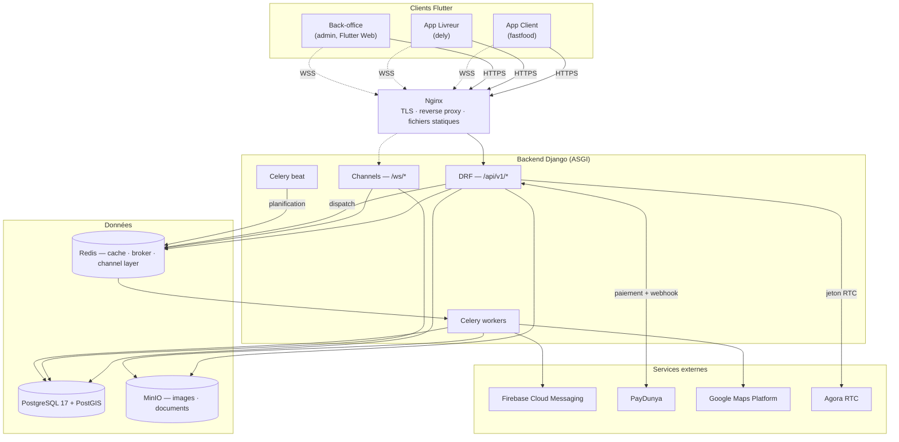
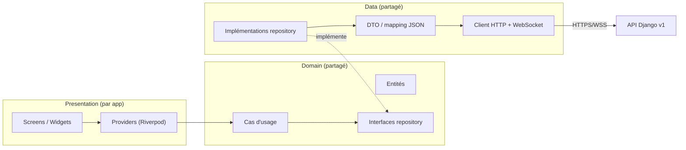

# Phase 6 — Migration Flutter vers l'architecture Django v2

**Statut** : à faire · **Date** : 2026-07-27 · **Entrée** : [02 — Architecture générale](02-architecture-generale.md), [ADR-009](adr/009-contrat-d-api.md)

---

## 1. Contexte et décision

Le backend (`backend/`) porte aujourd'hui l'intégralité du chemin critique et des domaines
secondaires (18 apps, chemin critique + fidélité, gamification, social, support, analytics,
abonnements — voir [README](README.md#avancement)). **Il ne reste que la Phase 6.** Les trois
applications Flutter (`El Corazon fastfood`, `El corazon dely`, `El Corazon admin`) n'ont en
revanche subi aucune migration : elles lisent et écrivent encore directement dans Supabase
(Auth, Postgres, Realtime, Storage), plus un canal Socket.IO résiduel côté `fastfood`.

**Décision actée pour cette phase : rupture nette, pas de coexistence.** ADR-009 envisageait une
bascule domaine par domaine avec les apps continuant d'attaquer Supabase pour les domaines non
encore migrés le temps de la transition. Ce n'est plus la voie retenue : **Supabase n'est plus
utilisé du tout** dès que ce plan est engagé. Chaque domaine migré au fil de ce plan supprime son
code Supabase correspondant au lieu de le laisser vivre à côté ; il n'y a pas de double lecture
transitoire ni de synchronisation entre les deux backends.

Conséquence directe : aucune migration de données de production Supabase n'est nécessaire (pas
d'utilisateurs réels à reprendre) — c'est un démarrage à froid sur le backend Django.

---

## 2. Plan architectural cible

### 2.1 Vue d'ensemble

Principe directeur inchangé (ADR déjà actés) : **le backend est la seule autorité métier, Flutter
est un client.** Aucune app Flutter n'a d'accès direct à une base de données après cette phase —
ni Postgres (Supabase), ni règle métier dupliquée côté client.

### 2.2 Couches côté client — Clean Architecture

Chaque app adopte la même stratification, alimentée par un module Dart partagé (§3.1) :

- **Presentation** reste propre à chaque app (écrans très différents entre client, livreur,
  back-office) — c'est la seule couche non partagée.
- **Domain** et **data** sont partagés au maximum : c'est la réponse structurelle à la duplication
  déjà identifiée (~130 fichiers de services entre les 3 apps, dont une trentaine de quasi-doublons
  — Phase 1 §7).

### 2.3 Contrat d'API à respecter côté client (ADR-009)

La couche `data` du module partagé doit implémenter, dès le départ, les règles du contrat propre —
c'est justement l'occasion actée par ADR-009 de lever les trois travers de l'ancien client Dart :

| Règle | Détail |
|---|---|
| Versionnement | `/api/v1/...`, jamais d'URL non versionnée |
| Liste paginée | `{count, next, previous, results}` — plus de lecture à la racine (`current_page`/`last_page`) |
| Erreurs | `application/problem+json` (RFC 9457) ; le client teste `code`, jamais `detail` (traduisible, changeant) |
| Dates | ISO 8601 UTC, garanties non nulles quand déclarées ainsi dans le schéma OpenAPI — plus de `DateTime.parse` sans garde |
| Montants | objet `{"amount": "...", "currency": "XOF"}`, jamais un float |
| Idempotence | en-tête `Idempotency-Key` obligatoire à générer côté client sur la création de commande et l'initiation de paiement |
| Documentation | schéma OpenAPI généré (`drf-spectacular`), servi sur `/api/v1/schema/` et publié comme artefact CI (`contrat`) — s'en servir comme source de vérité pour les DTO, éventuellement génération de code |

---

## 3. Ce qu'il faut faire

### 3.0 Prérequis backend (avant d'ouvrir le chantier Flutter)

- [x] **Chat WebSocket + tableau de bord restaurant construits** (2026-07-27) : `ws/orders/<id>/chat/`
      (`OrderChatConsumer`, relais non persisté client ↔ livreur) et
      `ws/restaurants/<id>/dashboard/` (`RestaurantDashboardConsumer`, lecture seule, diffusé par
      `OrderService.transition_to` en plus du suivi client). Testés (autorisation à la connexion,
      relais, non-fuite entre établissements) ; suite complète (875 tests), ruff et mypy verts.
- [ ] **Valider FCM en conditions réelles** : `apps/notifications/fcm.py` n'a jamais été exercé
      contre un vrai projet Firebase. La commande `python manage.py send_test_push <jeton>`
      (ajoutée le 2026-07-27, `apps/notifications/management/commands/send_test_push.py`) passe
      par le `PUSH_BACKEND` configuré — il ne reste plus qu'à fournir un projet Firebase, des
      credentials de service (`FCM_CREDENTIALS_PATH`, `FCM_PROJECT_ID`) et un jeton d'appareil de
      test pour exécuter la validation réelle.
- [x] **MinIO validé en conditions réelles** (2026-07-27) : `default_storage.save()` contre une
      instance MinIO locale réelle (`docker compose up -d minio`, bucket `elcorazon` créé), lecture
      via l'URL signée générée par `default_storage.url()` (200, contenu identique), accès direct
      sans signature refusé (403 — confirme que le stockage n'est pas public par défaut,
      `AWS_QUERYSTRING_AUTH=True`), suppression confirmée. Le connecteur S3/MinIO fonctionne tel que
      configuré.
- [ ] **Confirmer que la CI GitHub passe au vert** (`​.github/workflows/backend-ci.yml`) sur le
      remote désormais configuré.

### 3.1 Fondations Flutter partagées

- [ ] Créer un module Dart partagé entre les 3 apps (package local — ex. `packages/elcorazon_core/`
      — ou dépôt séparé selon la préférence d'outillage) contenant :
  - `network/` — client HTTP (`dio`), intercepteur JWT (attache le token, déclenche le refresh
    rotatif sur 401 — ADR-004), mapping des erreurs `problem+json` vers des exceptions typées par
    `code`.
  - `realtime/` — client WebSocket générique pour `ws/orders/<id>/tracking/` et `ws/couriers/me/`,
    avec reconnexion et rattrapage par numéro de séquence (déjà porté côté serveur par
    `common/realtime.py`).
  - `auth/` — stockage sécurisé des jetons, connexion/déconnexion, révocation multi-appareil.
  - `storage/` — upload et lecture via URL signée MinIO (remplace Supabase Storage).
  - `models/` — DTO générés ou alignés sur le schéma OpenAPI publié par la CI (`openapi.yaml`).
- [ ] Chaque app ne garde en propre que sa couche `presentation/` et les repositories spécifiques
      à ses écrans (ex. gestion de flotte côté `admin`, navigation GPS côté `dely`).

### 3.2 Authentification (fondation commune, transverse aux 3 apps)

- [ ] Remplacer Supabase Auth par le flux JWT Django (`/api/v1/auth/`) **simultanément dans les
      3 apps** — contrairement aux autres domaines, l'identité ne peut pas être migrée app par app
      sans casser les parcours qui en dépendent partout.
- [ ] Migrer la gestion de session (accès + refresh rotatif, révocation, déconnexion à distance).
- [ ] Aligner le modèle de rôles/permissions client sur ADR-005 (le back-office n'est plus la
      barrière d'autorisation, seulement un confort d'affichage — le serveur refuse de toute façon).

### 3.3 Migration domaine par domaine

Ordre retenu par app, du risque le plus faible (lecture seule) au plus élevé (argent, temps réel) :

**`fastfood` (client)**
1. Géographie / restaurants / catalogue (lecture seule)
2. Panier serveur (`carts`)
3. Commandes (`orders`) + codes promo (`promotions`, consommés à la création de commande)
4. Paiements (`payments`, PayDunya via le backend — plus jamais simulé côté client)
5. Suivi temps réel (WebSocket `ws/orders/<id>/tracking/`)
6. Fidélité, gamification, social, support (`loyalty`, `gamification`, `social`, `support`)
7. Notifications push FCM (absentes aujourd'hui dans cette app — à construire, pas seulement à
   migrer)

**`dely` (livreur)**
1. Auth (fait en 3.2)
2. Affectation et gestion des courses (`delivery`)
3. Émission de position (WebSocket `ws/couriers/me/`, déjà consommateur côté backend)
4. Notifications push (déjà en place côté FCM — à raccorder à l'API d'enregistrement d'appareil du
   backend, remplace l'enregistrement Supabase)
5. Retirer les clés Supabase/Google Maps codées en dur dans `api_config.dart` au passage (dette déjà
   identifiée, indépendante de la migration mais à traiter dans le même chantier)

**`admin` (back-office)**
1. Auth + permissions (fait en 3.2, ADR-005)
2. Gestion établissements / catalogue / personnel (`restaurants`, `catalog`, `accounts` scoping)
3. Supervision commandes / livraison (lecture des mêmes endpoints que `fastfood`/`dely`, vues
   agrégées)
4. Analytics / rapports (`analytics`)
5. Notifications push (absentes aujourd'hui — à construire)

Pour chaque domaine : (a) consulter le schéma OpenAPI du domaine, (b) écrire le repository Dart
contre ce contrat, (c) remplacer l'appel Supabase existant dans les providers/services, (d)
supprimer le code Supabase mort immédiatement (pas de code mort transitoire — cf. §1), (e) valider
le parcours manuellement.

### 3.4 Flux externes à rattacher

- [ ] **Agora** : la signalisation d'appel (qui appelle qui) migre de Supabase Realtime vers un
      canal Django (WebSocket ou endpoint dédié) ; le flux média reste Agora RTC en pair-à-pair,
      seul le jeton est délivré par l'API (`API -->|jeton RTC| RTC` dans le schéma §2.1).
- [ ] **Stockage** : toutes les images produits, avatars et documents livreurs passent par les URL
      signées MinIO servies par le backend.

### 3.5 Nettoyage Supabase

- [ ] Retirer `supabase_flutter`, `lib/supabase/`, toute clé/URL Supabase des 3 `pubspec.yaml` et
      fichiers `.env`.
- [ ] Retirer le canal Socket.IO résiduel dans `fastfood` (`socket_service.dart` et usages),
      remplacé par le WebSocket Django.
- [ ] Mettre à jour `CAHIER_DES_CHARGES.md` et `ETAT_FONCTIONNALITES.md` (actuellement rédigés pour
      l'architecture Supabase) : soit les archiver comme référence historique — à l'image du
      backend Laravel, consultable dans l'historique git jusqu'au commit `56e0bec` — soit les
      réécrire pour décrire la v2.

### 3.6 Infrastructure de déploiement réelle

- [ ] Provisionner l'environnement cible (Kubernetes selon `02-architecture-generale.md §9`, ou une
      étape intermédiaire sur le `docker-compose.yml` existant) avec les secrets réels (Firebase,
      PayDunya production, Google Maps, Agora).
- [ ] Domaine + TLS via Nginx ; le job CI `image` construit déjà l'image — il manque la publication
      vers un registre et le déploiement effectif.

### 3.7 Validation de bout en bout et bascule finale

- [ ] Parcours complet **client** : inscription → catalogue → panier → commande → paiement → suivi
      temps réel → notation.
- [ ] Parcours complet **livreur** : réception de course → navigation → livraison → notifications.
- [ ] Parcours complet **admin** : gestion établissement/produits/personnel → supervision
      commandes/livraison → rapports.
- [ ] Aucun appel Supabase actif dans les 3 apps — le schéma cible du §2.1 est enfin la réalité.

---

## 4. Suivi

- [ ] 3.0 — Prérequis backend
- [ ] 3.1 — Fondations Flutter partagées
- [ ] 3.2 — Authentification commune
- [ ] 3.3 — Migration `fastfood`
- [ ] 3.3 — Migration `dely`
- [ ] 3.3 — Migration `admin`
- [ ] 3.4 — Flux externes (Agora, stockage)
- [ ] 3.5 — Nettoyage Supabase
- [ ] 3.6 — Infrastructure de déploiement réelle
- [ ] 3.7 — Validation de bout en bout et bascule finale
